# Image Classification with EXECUTORCH

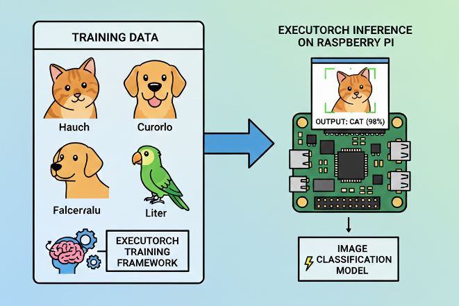

*Implementing efficient image classification using PyTorch EXECUTORCH on edge devices*

---

## Introduction

Image classification is a fundamental computer vision task that powers countless real-world applications—from quality control in manufacturing to wildlife monitoring, medical diagnostics, and smart home devices. In the edge AI landscape, the ability to run these models efficiently on resource-constrained devices has become increasingly critical for privacy-preserving, low-latency applications.

In the chapter [Image Classification Fundamentals](https://mjrovai.github.io/EdgeML_Made_Ease_ebook/raspi/image_classification/image_classification_fund.html), we explored image classification using **TensorFlow Lite**, demonstrating how to deploy efficient neural networks on the Raspberry Pi. That tutorial covered the complete workflow from model conversion to real-time camera inference, achieving excellent results with the **MobileNet V2** architecture and a real dataset (CIFAR-10).

This chapter takes a parallel approach using [**PyTorch EXECUTORCH**](https://docs.pytorch.org/executorch/stable/index.html)—Meta's modern solution for edge deployment. Rather than replacing our TFLite knowledge, this chapter expands your edge AI toolkit, giving us the flexibility to choose the right framework for our specific needs.

### What is EXECUTORCH?

EXECUTORCH is PyTorch's official solution for deploying machine learning models on edge devices, from smartphones and embedded systems to microcontrollers and IoT devices. Released in 2023, it represents Meta's commitment to bringing the entire PyTorch ecosystem to edge computing.

**Core Capabilities:**

- **Native PyTorch Integration**: Seamless workflow from model training to edge deployment without switching frameworks
- **Efficient Execution**: Optimized runtime designed specifically for resource-constrained devices
- **Broad Portability**: Runs on diverse hardware platforms (ARM, x86, specialized accelerators)
- **Flexible Backend System**: Extensible delegate architecture for hardware-specific optimizations
- **Quantization Support**: Built-in integration with PyTorch's quantization tools for model compression

### Why EXECUTORCH for Edge AI?

EXECUTORCH offers compelling advantages for edge deployment:

**1. Unified Workflow**
If we are training models in PyTorch, EXECUTORCH provides a natural deployment path without framework switching. This eliminates conversion errors and maintains model fidelity from training to deployment.

**2. Modern Architecture**
Built from the ground up for edge computing with contemporary best practices, EXECUTORCH incorporates lessons learned from previous mobile deployment frameworks.

**3. Comprehensive Quantization**
Native support for various quantization techniques (dynamic, static, quantization-aware training) enables significant model size reduction with minimal accuracy loss.

**4. Extensible Backend System**
The delegate system allows seamless integration with hardware accelerators (XNNPACK for CPU optimization, QNN for Qualcomm chips, CoreML for Apple devices, and more).

**5. Active Development**
Backed by Meta with rapid iteration and strong community support, ensuring the framework evolves with edge AI needs.

**6. Growing Model Zoo**
Access to pretrained models specifically optimized for edge deployment, with consistent performance across devices.

### Framework Comparison: EXECUTORCH vs TensorFlow Lite

Understanding when to choose each framework is crucial for effective edge deployment:

| Feature                  | EXECUTORCH                             | TensorFlow Lite                 |
| ------------------------ | -------------------------------------- | ------------------------------- |
| **Training Framework**   | PyTorch                                | TensorFlow/Keras                |
| **Maturity**             | Newer (2023+)                          | Mature (2017+)                  |
| **Model Format**         | `.pte`                                 | `.tflite (.lite)`               |
| **Quantization**         | PyTorch native quantization            | TF quantization-aware training  |
| **Backend Acceleration** | Delegate system (XNNPACK, QNN, CoreML) | Delegates (GPU, NNAPI, Hexagon) |
| **Community**            | Rapidly growing                        | Large, established              |
| **Hardware Support**     | Expanding quickly                      | Extensive, mature               |
| **Learning Curve**       | Easier for PyTorch users               | Easier for TF/Keras users       |
| **Documentation**        | Growing, modern                        | Comprehensive, mature           |
| **Industry Adoption**    | Increasing in research                 | Widespread in production        |

**The Reality: Both Are Excellent Choices**

In practice, both frameworks achieve similar goals with different philosophies. Our choice often comes down to:

1. Our training framework preference
2. Team expertise and existing infrastructure
3. Specific hardware requirements
4. Project timeline and maturity needs

This chapter demonstrates that transitioning between frameworks is straightforward, allowing us to make informed decisions based on project needs rather than framework limitations.

---

## Setting Up the Environment

### Updating the Raspberry Pi

First, ensure that the Raspberry Pi is up to date:

```bash
sudo apt update
sudo apt upgrade -y
sudo reboot  # Reboot to ensure all updates take effect
```

### Installing Required System Level Libraries

Install Python tools, camera libraries, and build dependencies for PyTorch:

```bash
sudo apt install -y python3-pip python3-venv python3-picamera2
sudo apt install -y libcamera-dev libcamera-tools libcamera-apps
sudo apt install -y libopenblas-dev libjpeg-dev zlib1g-dev libpng-dev
```

**Picamera2 Installation Test**

We can test the camera with:

```bash
rpicam-hello --list-cameras
```

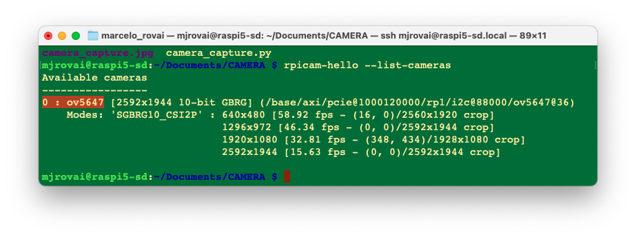

> We should see that we have the OV5647 cam installed. 

Now, let's create a test script to verify everything works:

[camera_capture.py](https://github.com/Mjrovai/EdgeML-with-Raspberry-Pi/blob/main/EXECUTORCH/scripts/camera_capture.py)

```python
import numpy as np
from picamera2 import Picamera2
import time

print(f"NumPy version: {np.__version__}")

# Initialize camera
picam2 = Picamera2()

config = picam2.create_preview_configuration(main={"size":(640,480)}) 
picam2.configure(config)
picam2.start()

# Wait for camera to warm up
time.sleep(2)

print("Camera working in the system!")

# Capture image
picam2.capture_file("camera_capture.jpg")
print("Image captured: cam_test.jpg")

# Stop camera
picam2.stop()
picam2.close()

```

> A test image should be created in the current directory

### Setting up a Virtual Environment

First, let's confirm the System Python version:

```bash
python --version
```

If we use the latest Raspberry Pi OS (based on Debian Trixie), it should be:

`3.13.5`

As of today (January 2026), ExecuTorch officially supports only **Python 3.10 to 3.12**; Python 3.13.5 is too new and will likely cause compatibility issues. Since **Debian Trixie ships with Python 3.13** by default, we'll need to install a compatible Python version alongside it. 

One solution is to install [Pyenv](https://github.com/pyenv/pyenv), so that we can easily manage multiple Python versions for different projects without affecting the system Python.

> If the Raspberry Pi OS is the legacy, the Python version should be 3.11, and it is not necesary to install Pyenv.

#### Install pyenv Dependencies

```bash
sudo apt update
sudo apt install -y build-essential libssl-dev zlib1g-dev \
    libbz2-dev libreadline-dev libsqlite3-dev curl git \
    libncursesw5-dev xz-utils tk-dev libxml2-dev \
    libxmlsec1-dev libffi-dev liblzma-dev \
    libopenblas-dev libjpeg-dev libpng-dev cmake
```

#### Install pyenv

```bash
# Download and install pyenv
curl https://pyenv.run | bash
```

#### Configure Shell

Add pyenv to `~/.bashrc`:

```bash
cat >> ~/.bashrc << 'EOF'

# pyenv configuration
export PYENV_ROOT="$HOME/.pyenv"
[[ -d $PYENV_ROOT/bin ]] && export PATH="$PYENV_ROOT/bin:$PATH"
eval "$(pyenv init -)"
EOF
```

Reload the shell:

```bash
source ~/.bashrc
```

Verify if pyenv is installed:

```bash
pyenv --version
```

#### Install Python 3.11 (or 3.12)

```bash
# See available versions
pyenv install --list | grep " 3.11"

# Install Python 3.11.14 (latest 3.11 stable)
pyenv install 3.11.14

# Or install Python 3.12.3 if you prefer
# pyenv install 3.12.12
```

> This will take a few minutes to compile.

#### Create ExecuTorch Workspace

```bash
cd Documents 	
mkdir EXECUTORCH
cd EXECUTORCH

# Set Python 3.11.14 for this directory
pyenv local 3.11.14

# Verify
python --version  # Should show Python 3.11.14
```

#### Create Virtual Environment

```bash
python -m venv executorch-venv
source executorch-venv/bin/activate

# Verify if we're using the correct Python
which python
python --version
```

To exit the virtual environment later:

```bash
deactivate
```

### Install Python Packages

> Ensure we're in the virtual environment (venv)

```bash
pip install --upgrade pip
pip install numpy pillow matplotlib opencv-python
```

Verify installation:

```bash
pip list | grep -E "(numpy|pillow|opencv)"
```

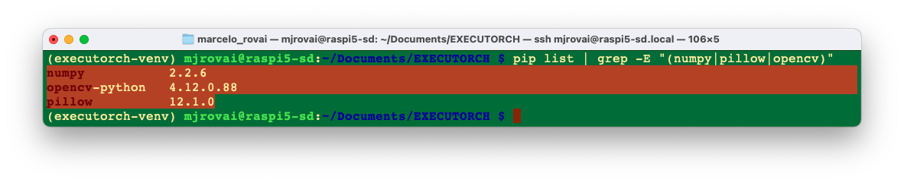

## PyTorch and EXECUTORCH Installation

### Installing PyTorch for Raspberry Pi

PyTorch provides pre-built wheels for ARM64 architecture (Raspberry Pi 3/4/5). 

For **Raspberry Pi 4/5 (aarch64)**:

```bash
# Install PyTorch (CPU version for ARM64)
pip install torch torchvision --index-url https://download.pytorch.org/whl/cpu
```

> For the **Raspberry Pi Zero 2 W** (32-bit ARM), we may need to build from source or use lighter alternatives, which are not covered here. 

Verify PyTorch installation:

```bash
python -c "import torch; print(f'PyTorch version: {torch.__version__}')"
```

We will get, for example, `PyTorch version: 2.9.1+cpu`

### Installing EXECUTORCH Runtime

EXECUTORCH can be installed via pip:

```bash
pip install executorch
```

**Building from Source (Optional - for latest features):**

If we want the absolute latest features or need to customize:

```bash
# Clone the repository
git clone https://github.com/pytorch/executorch.git
cd executorch

# Install dependencies
./install_requirements.sh

# Install EXECUTORCH in development mode
pip install -e .
```

### Verifying the Setup

Let's verify our setup with a test script. Create `setup_test.py` (for example, using nano):

```python
import torch
import numpy as np
from PIL import Image
import executorch

print("=" * 50)
print("SETUP VERIFICATION")
print("=" * 50)

# Check versions
print(f"PyTorch version: {torch.__version__}")
print(f"NumPy version: {np.__version__}")
print(f"PIL version: {Image.__version__}")
print(f"EXECUTORCH available: {executorch is not None}")

# Test basic PyTorch functionality
x = torch.randn(3, 224, 224)
print(f"\nCreated test tensor with shape: {x.shape}")

# Test PIL
test_img = Image.new('RGB', (224, 224), color='red')
print(f"Created test PIL image: {test_img.size}")

print("\n✓ Setup verification complete!")
print("=" * 50)
```

Run it:

```bash
python setup_test.py
```

Expected output (the versions can be different):
```
==================================================
SETUP VERIFICATION
==================================================
PyTorch version: 2.9.1+cpu
NumPy version: 2.2.6
PIL version: 12.1.0
EXECUTORCH available: True

Created test tensor with shape: torch.Size([3, 224, 224])
Created test PIL image: (224, 224)

✓ Setup verification complete!
==================================================
```

---

## Image Classification using MobileNet V2

### Working directory:

```bash
cd Documents
cd EXECUTORCH
mkdir IMG_CLASS
cd IMG_CLASS
mkdir MOBILENET
cd MOBILENET
mkdir models images notebooks
```

### Making inference with Torch

Load an image from the internet, for example, a cat: `"https://upload.wikimedia.org/wikipedia/commons/3/3a/Cat03.jpg"`

And save it in the images folder as "cat.jpg":

```bash
wget "https://upload.wikimedia.org/wikipedia/commons/3/3a/Cat03.jpg" \
     -O ./images/cat.jpg
```

Now, let's create a test program where we should take into consideration:

1. **First run** - Downloads model & labels (and saves them)
2. **Preprocessing** - MobileNetV2 expects 224x224 images with ImageNet normalization 
3. **torch.no_grad()** -Disables gradient calculation for faster inference
4. **Timing** - Measures only inference time, not preprocessing
5. **Softmax** - Converts raw outputs to probabilities 
6. **Top-5** - Shows the 5 most likely classes

and save it as [img_class_test_torch.py](https://github.com/Mjrovai/EdgeML-with-Raspberry-Pi/blob/main/EXECUTORCH/scripts/img_class_test_torch.py):

```python
import torch
import torchvision.transforms as transforms
from torchvision import models
from PIL import Image
import time
import json
import urllib.request
import os

# Paths
MODEL_PATH = "models/mobilenet_v2.pth"
LABELS_PATH = "models/imagenet_labels.json"
IMAGE_PATH = "images/cat.jpg"

# Download and save ImageNet labels (only first time)
if not os.path.exists(LABELS_PATH):
    print("Downloading ImageNet labels...")
    LABELS_URL = "https://raw.githubusercontent.com/anishathalye/imagenet-simple-labels/master/imagenet-simple-labels.json"
    with urllib.request.urlopen(LABELS_URL) as url:
        labels = json.load(url)
    
    # Save labels locally
    with open(LABELS_PATH, 'w') as f:
        json.dump(labels, f)
    print(f"Labels saved to {LABELS_PATH}")
else:
    print("Loading labels from disk...")
    with open(LABELS_PATH, 'r') as f:
        labels = json.load(f)

# Load or download model
if not os.path.exists(MODEL_PATH):
    print("Downloading MobileNetV2 model...")
    model = models.mobilenet_v2(pretrained=True)
    model.eval()
    torch.save(model.state_dict(), MODEL_PATH)
    print(f"Model saved to {MODEL_PATH}")
else:
    print("Loading model from disk...")
    model = models.mobilenet_v2()
    model.load_state_dict(torch.load(MODEL_PATH, map_location='cpu'))
    model.eval()

# Define image preprocessing
preprocess = transforms.Compose([
    transforms.Resize(256),
    transforms.CenterCrop(224),
    transforms.ToTensor(),
    transforms.Normalize(mean=[0.485, 0.456, 0.406], 
                         std=[0.229, 0.224, 0.225]),
])

# Load and preprocess image
print(f"\nLoading image from {IMAGE_PATH}...")
img = Image.open(IMAGE_PATH)
img_tensor = preprocess(img)
batch = img_tensor.unsqueeze(0)

# Perform inference with timing
print("Running inference...")
start_time = time.time()

with torch.no_grad():
    output = model(batch)
    
inference_time = (time.time() - start_time) * 1000

# Get predictions
probabilities = torch.nn.functional.softmax(output[0], dim=0)
top5_prob, top5_idx = torch.topk(probabilities, 5)

# Display results
print("\n" + "="*50)
print("CLASSIFICATION RESULTS")
print("="*50)
print(f"Inference Time: {inference_time:.2f} ms\n")
print("Top 5 Predictions:")
print("-"*50)

for i in range(5):
    idx = top5_idx[i].item()
    prob = top5_prob[i].item()
    print(f"{i+1}. {labels[idx]:20s} - {prob*100:.2f}%")

print("="*50)
```

The result:

```bash
Loading image from images/cat.jpg...
Running inference...

==================================================
CLASSIFICATION RESULTS
==================================================
Inference Time: 86.12 ms

Top 5 Predictions:
--------------------------------------------------
1. tiger cat            - 47.44%
2. Egyptian Mau         - 37.61%
3. lynx                 - 6.91%
4. tabby cat            - 6.22%
5. plastic bag          - 0.47%
==================================================
```

The inference was OK, taking 86ms (first time). We can also verify the size of the saved Torch model

```bash
ls -lh ./models/mobilenet_v2.pth
```

Which has `14Mb`.

## Exporting Models to EXECUTORCH Format

Unlike TensorFlow Lite, where we downloaded pre-converted .tflite models, with EXECUTORCH, we typically export PyTorch models to the `.pte` (PyTorch EXECUTORCH) format ourselves. This gives us full control over the export process.

### Understanding the Export Process

The EXECUTORCH export process involves several steps:

1. **Load a PyTorch model** (pretrained or custom)
2. **Trace/script the model** (convert to TorchScript)
4. **Export to EXECUTORCH format** (.pte file)

**Optional optimization steps:**

- Quantization (before or during export)
- Backend delegation (XNNPACK, QNN, etc.)
- Memory planning optimization

**The complete ExecuTorch pipeline:**

1. `export()` → Captures the model graph
2. `to_edge()` → Converts to Edge dialect
3. `to_executorch()` → Lowers to ExecuTorch format
4. `.buffer` → Gets the binary data to save

```
PyTorch Model (.pt/.pth)
          ↓
    torch.export()         # Export to ExportedProgram
          ↓
    to_edge()              # Convert to Edge dialect
          ↓
    to_executorch()        # Generate EXECUTORCH program
          ↓
   .pte file               # Ready for edge deployment
```

### Exporting MobileNet V2 to ExecuTorch

Let's export a MobileNet V2 model to EXECUTORCH basic format. Creating a Python script as [convert_mobv2_executorch.py](https://github.com/Mjrovai/EdgeML-with-Raspberry-Pi/blob/main/EXECUTORCH/scripts/convert_mobv2_executorch.py)

```python
import torch
from torchvision import models
from executorch.exir import to_edge
from torch.export import export

# Paths
PYTORCH_MODEL_PATH = "models/mobilenet_v2.pth"
EXECUTORCH_MODEL_PATH = "models/mobilenet_v2.pte"

print("Loading PyTorch model...")
# Load the saved model
model = models.mobilenet_v2()
model.load_state_dict(torch.load(PYTORCH_MODEL_PATH, map_location='cpu'))
model.eval()

# Create example input (batch_size=1, channels=3, height=224, width=224)
example_input = (torch.randn(1, 3, 224, 224),)

print("Exporting to ExecuTorch format...")

# Step 1: Export to EXIR (ExecuTorch Intermediate Representation)
print("  1. Capturing model with torch.export...")
exported_program = export(model, example_input)

# Step 2: Convert to Edge dialect
print("  2. Converting to Edge dialect...")
edge_program = to_edge(exported_program)

# Step 3: Convert to ExecuTorch program
print("  3. Lowering to ExecuTorch...")
executorch_program = edge_program.to_executorch()

# Step 4: Save as .pte file
print("  4. Saving to .pte file...")
with open(EXECUTORCH_MODEL_PATH, "wb") as f:
    f.write(executorch_program.buffer)

print(f"\n? Model successfully exported to {EXECUTORCH_MODEL_PATH}")

# Display file sizes for comparison
import os
pytorch_size = os.path.getsize(PYTORCH_MODEL_PATH) / (1024 * 1024)
executorch_size = os.path.getsize(EXECUTORCH_MODEL_PATH) / (1024 * 1024)

print("\n" + "="*50)
print("MODEL SIZE COMPARISON")
print("="*50)
print(f"PyTorch model:    {pytorch_size:.2f} MB")
print(f"ExecuTorch model: {executorch_size:.2f} MB")
print(f"Reduction:        {((pytorch_size - executorch_size) / pytorch_size * 100):.1f}%")
print("="*50)

```

Runing the export script:

```bash
python export_mobv2_executorch.py
```

We will get:

```bash
Loading PyTorch model...
Exporting to ExecuTorch format...
  1. Capturing model with torch.export...
  2. Converting to Edge dialect...
  3. Lowering to ExecuTorch...
  4. Saving to .pte file...

? Model successfully exported to models/mobilenet_v2.pte

==================================================
MODEL SIZE COMPARISON
==================================================
PyTorch model:    13.60 MB
ExecuTorch model: 13.58 MB
Reduction:        0.2%
==================================================
```

The basic ExecuTorch conversion doesn't compress the model much - it's mainly for runtime efficiency. To get **real size reduction**, we need **quantization**, which we will explore later. But first, let's do an inference test using the converted model. 

Runing the script [mobv2_executorch.py](https://github.com/Mjrovai/EdgeML-with-Raspberry-Pi/blob/main/EXECUTORCH/scripts/mobv2_executorch.py):

```python
import torch
import torchvision.transforms as transforms
from PIL import Image
import time
import json
from executorch.extension.pybindings.portable_lib import _load_for_executorch

# Paths
EXECUTORCH_MODEL_PATH = "models/mobilenet_v2.pte"
LABELS_PATH = "models/imagenet_labels.json"
IMAGE_PATH = "images/cat.jpg"

# Load labels
print("Loading labels...")
with open(LABELS_PATH, 'r') as f:
    labels = json.load(f)

# Load ExecuTorch model
print(f"Loading ExecuTorch model from {EXECUTORCH_MODEL_PATH}...")
model = _load_for_executorch(EXECUTORCH_MODEL_PATH)

# Define image preprocessing (same as PyTorch)
preprocess = transforms.Compose([
    transforms.Resize(256),
    transforms.CenterCrop(224),
    transforms.ToTensor(),
    transforms.Normalize(mean=[0.485, 0.456, 0.406], 
                         std=[0.229, 0.224, 0.225]),
])

# Load and preprocess image
print(f"Loading image from {IMAGE_PATH}...")
img = Image.open(IMAGE_PATH)
img_tensor = preprocess(img)
batch = img_tensor.unsqueeze(0)  # Add batch dimension

# Perform inference with timing
print("Running ExecuTorch inference...")
start_time = time.time()

# ExecuTorch expects a tuple of inputs
output = model.forward((batch,))

inference_time = (time.time() - start_time) * 1000  # Convert to ms

# Get predictions
output_tensor = output[0]  # ExecuTorch returns a list
probabilities = torch.nn.functional.softmax(output_tensor[0], dim=0)
top5_prob, top5_idx = torch.topk(probabilities, 5)

# Display results
print("\n" + "="*50)
print("EXECUTORCH CLASSIFICATION RESULTS")
print("="*50)
print(f"Inference Time: {inference_time:.2f} ms\n")
print("Top 5 Predictions:")
print("-"*50)

for i in range(5):
    idx = top5_idx[i].item()
    prob = top5_prob[i].item()
    print(f"{i+1}. {labels[idx]:20s} - {prob*100:.2f}%")

print("="*50)

```

As a result, we got a similar inference result, but a much higher latency (almost 2.5 seconds), which was unexpected. 

```bash
Loading labels...
Loading ExecuTorch model from models/mobilenet_v2.pte...
Loading image from images/cat.jpg...
Running ExecuTorch inference...

==================================================
EXECUTORCH CLASSIFICATION RESULTS
==================================================
Inference Time: 2445.78 ms

Top 5 Predictions:
--------------------------------------------------
1. tiger cat            - 47.44%
2. Egyptian Mau         - 37.61%
3. lynx                 - 6.91%
4. tabby cat            - 6.22%
5. plastic bag          - 0.47%
==================================================
```

That export path produces a generic ExecuTorch CPU graph with reference kernels and no backend optimizations or fusions, so significantly higher latency than PyTorch is expected for MobileNet_v2 on a Pi 5.

ExecuTorch is designed to shine when delegated to a backend (XNNPACK, OpenVINO, etc.), where large subgraphs are lowered into highly optimized kernels. Without a delegate, most of the graph runs on the generic portable path, which is known to be significantly slower than PyTorch for many models.

So, let's export the .pth model again with a CPU‑optimized backend (e.g., XNNPACK) and run with that backend enabled; this alone should reduce latency when compared with the naïve interpreter path.

Here's the corrected conversion script with XNNPACK delegation ([convert_mobv2_xnnpack.py](https://github.com/Mjrovai/EdgeML-with-Raspberry-Pi/blob/main/EXECUTORCH/scripts/convert_mobv2_xnnpack.py)):

```python
import torch
from torchvision import models
from executorch.exir import to_edge
from torch.export import export
from executorch.backends.xnnpack.partition.xnnpack_partitioner import XnnpackPartitioner

# Paths
PYTORCH_MODEL_PATH = "models/mobilenet_v2.pth"
EXECUTORCH_MODEL_PATH = "models/mobilenet_v2_xnnpack.pte"

print("Loading PyTorch model...")
model = models.mobilenet_v2()
model.load_state_dict(torch.load(PYTORCH_MODEL_PATH, map_location='cpu'))
model.eval()

# Create example input
example_input = (torch.randn(1, 3, 224, 224),)

print("Exporting to ExecuTorch with XNNPACK backend...")

# Step 1: Export to EXIR
print("  1. Capturing model with torch.export...")
exported_program = export(model, example_input)

# Step 2: Convert to Edge dialect with XNNPACK partitioner
print("  2. Converting to Edge dialect with XNNPACK delegation...")
edge_program = to_edge(exported_program)

# Step 3: Partition for XNNPACK backend
print("  3. Delegating to XNNPACK backend...")
edge_program = edge_program.to_backend(XnnpackPartitioner())

# Step 4: Convert to ExecuTorch program
print("  4. Lowering to ExecuTorch...")
executorch_program = edge_program.to_executorch()

# Step 5: Save as .pte file
print("  5. Saving to .pte file...")
with open(EXECUTORCH_MODEL_PATH, "wb") as f:
    f.write(executorch_program.buffer)

print(f"\n? Model successfully exported to {EXECUTORCH_MODEL_PATH}")

# Display file size
import os
pytorch_size = os.path.getsize(PYTORCH_MODEL_PATH) / (1024 * 1024)
executorch_size = os.path.getsize(EXECUTORCH_MODEL_PATH) / (1024 * 1024)

print("\n" + "="*50)
print("MODEL SIZE COMPARISON")
print("="*50)
print(f"PyTorch model:           {pytorch_size:.2f} MB")
print(f"ExecuTorch+XNNPACK:      {executorch_size:.2f} MB")
print("="*50)
```

Runing it we get:

```bash
Loading PyTorch model...
Exporting to ExecuTorch with XNNPACK backend...
  1. Capturing model with torch.export...
  2. Lowering to Edge with XNNPACK delegation...
  3. Converting to ExecuTorch...
  4. Saving to .pte file...

? Model successfully exported to models/mobilenet_v2_xnnpack.pte

==================================================
MODEL SIZE COMPARISON
==================================================
PyTorch model:           13.60 MB
ExecuTorch+XNNPACK:      13.35 MB
==================================================
```

We did not gain in terms of size, but let's run the same inference script as before, with this new converted model, to inspect the latency:

the result:

```
Loading labels...
Loading ExecuTorch model from models/mobilenet_v2_xnnpack.pte...
Loading image from images/cat.jpg...
Running ExecuTorch inference...

==================================================
EXECUTORCH CLASSIFICATION RESULTS
==================================================
Inference Time: 19.95 ms

Top 5 Predictions:
--------------------------------------------------
1. tiger cat            - 47.44%
2. Egyptian Mau         - 37.61%
3. lynx                 - 6.91%
4. tabby cat            - 6.22%
5. plastic bag          - 0.47%
==================================================
```

Now, the ExecuTorch runtime detects the backend automatically from the .pte file metadata. We have achieved much faster inference: 20ms instead of 2445ms. This latency is, in fact, several times faster than PyTorch. 

**Why XNNPACK is so fast:**

- ✅ ARM NEON SIMD optimizations
- ✅ Multi-threading on Raspberry Pi's 4 cores
- ✅ Operator fusion and memory optimization
- ✅ Cache-friendly memory access patterns

**This demonstrates:**

1. ExecuTorch (basic)  without a backend = **don't use in production**
2. ExecuTorch + XNNPACK = **production-ready edge AI**
3. Raspberry Pi 5 can do **50+ inferences/second** at this speed!

Now we can add quantization to get an even smaller model size while maintaining (or even increasing) this speed!

### Model Quantization

Quantization reduces model size and can further improve inference speed. EXECUTORCH supports PyTorch's native quantization.

**Quantization Overview**

Quantization is a technique that reduces the precision of numbers used in a model’s computations and stored weights—typically from 32-bit floats to 8-bit integers. This reduces the model’s memory footprint, speeds up inference, and lowers power consumption, often with minimal loss in accuracy.

Quantization is especially important for deploying models on edge devices such as wearables, embedded systems, and microcontrollers, which often have limited compute, memory, and battery capacity. By quantizing models, we can make them significantly more efficient and suitable for these resource-constrained environments.

**Quantization in ExecuTorch**

ExecuTorch uses [torchao](https://github.com/pytorch/ao/tree/main/torchao) as its quantization library. This integration allows ExecuTorch to leverage PyTorch-native tools for preparing, calibrating, and converting quantized models.

Quantization in ExecuTorch is backend-specific. Each backend defines how models should be quantized based on its hardware capabilities. Most ExecuTorch backends use the torchao [PT2E quantization](https://docs.pytorch.org/ao/main/tutorials_source/pt2e_quant_ptq.html) flow, which works with models exported with torch.export and enables tailored quantization for each backend. 

For a quantized XNNPACK `.pte` we need a different pipeline: PT2E quantization (with `XNNPACKQuantizer`), then lowering with `XnnpackPartitioner` before `to_executorch()`. Otherwise, we will hit errors or get an undelegated model.

For the conversion, we need: (1) calibrate with real, preprocessed images, and (2) compute the quantized `.pte` size after you actually write the file. 

First, let us create a small `calib_images/` folder (e.g., 50–100 natural images across a few classes). A simple way is to reuse an existing dataset (e.g., CIFAR‑10) and save 50–100 images into `calib_images/` with an ImageNet‑style folder layout.

The script [gen_calibr_images.py](https://github.com/Mjrovai/EdgeML-with-Raspberry-Pi/blob/main/EXECUTORCH/scripts/gen_calibr_images.py) will:
	•	Download CIFAR‑10.
	•	Pick 10 classes × 10 images each = 100 images.
	•	Save them under `calib_images/<class_name>/img_XXX.jpg`.

```python
import os
from pathlib import Path

import torch
from torchvision import datasets, transforms
from torchvision.utils import save_image

# Where to store calibration images
OUT_ROOT = Path("calib_images")
OUT_ROOT.mkdir(parents=True, exist_ok=True)

# 1) Load a small, natural-image dataset (CIFAR-10)
transform = transforms.ToTensor()  # we will NOT normalize here
dataset = datasets.CIFAR10(
    root="data",
    train=True,
    download=True,
    transform=transform,
)

# 2) Map label index -> class name (CIFAR-10 has 10 classes)
classes = dataset.classes  # ['airplane', 'automobile', ..., 'truck']

# 3) Choose how many classes and images per class
num_classes = 10
images_per_class = 10   # 10 x 10 = 100 images

# 4) Collect and save images
counts = {cls: 0 for cls in classes[:num_classes]}

for img, label in dataset:
    cls_name = classes[label]
    if cls_name not in counts:
        continue
    if counts[cls_name] >= images_per_class:
        continue

    # Make class subdir
    class_dir = OUT_ROOT / cls_name
    class_dir.mkdir(parents=True, exist_ok=True)

    idx = counts[cls_name]
    out_path = class_dir / f"img_{idx:04d}.jpg"
    save_image(img, out_path)

    counts[cls_name] += 1

    # Stop when we have enough
    if all(counts[c] >= images_per_class for c in counts):
        break

print("Saved calibration images:")
for cls_name, n in counts.items():
    print(f"  {cls_name}: {n} images")
print(f"\nRoot folder: {OUT_ROOT.resolve()}")
```

Let's use the inference script [convert_mobv2_xnnpack_int8.py](https://github.com/Mjrovai/EdgeML-with-Raspberry-Pi/blob/main/EXECUTORCH/scripts/convert_mobv2_xnnpack_int8.py), which is the same inference script as before, with this new int8 converted model to inspect the latency:

```python
import os
import torch
import torchvision.models as models
import torchvision.transforms as transforms
import torchvision.datasets as datasets

from torch.export import export
from torchao.quantization.pt2e.quantize_pt2e import (
    prepare_pt2e,
    convert_pt2e,
)
from executorch.backends.xnnpack.quantizer.xnnpack_quantizer import (
    get_symmetric_quantization_config,
    XNNPACKQuantizer,
)
from executorch.backends.xnnpack.partition.xnnpack_partitioner import (
    XnnpackPartitioner,
)
from executorch.exir import to_edge_transform_and_lower

PYTORCH_MODEL_PATH = "models/mobilenet_v2.pth"
EXECUTORCH_QUANTIZED_PATH = "models/mobilenet_v2_quantized_xnnpack.pte"
CALIB_IMAGES_DIR = "calib_images"   # <-- put some natural images here

# 1) Load FP32 model
model = models.mobilenet_v2()
model.load_state_dict(torch.load(PYTORCH_MODEL_PATH, map_location="cpu"))
model.eval()

# Example input only defines shapes for export
example_inputs = (torch.randn(1, 3, 224, 224),)

# 2) Configure XNNPACK quantizer (global symmetric config)
qparams = get_symmetric_quantization_config(is_per_channel=True)
quantizer = XNNPACKQuantizer()
quantizer.set_global(qparams)

# 3) Export float model for PT2E and prepare for quantization
exported = torch.export.export(model, example_inputs)
training_ep = exported.module()
prepared = prepare_pt2e(training_ep, quantizer)

# 4) Calibration with REAL images using SAME preprocessing as inference
calib_transform = transforms.Compose([
    transforms.Resize(256),
    transforms.CenterCrop(224),
    transforms.ToTensor(),
    transforms.Normalize(mean=[0.485, 0.456, 0.406],
                         std=[0.229, 0.224, 0.225]),
])

calib_dataset = datasets.ImageFolder(CALIB_IMAGES_DIR, transform=calib_transform)
calib_loader = torch.utils.data.DataLoader(
    calib_dataset, batch_size=1, shuffle=True
)

print(f"Calibrating on {len(calib_dataset)} images from {CALIB_IMAGES_DIR}...")

num_calib = min(100, len(calib_dataset))  # or adjust
with torch.no_grad():
    for i, (calib_img, _) in enumerate(calib_loader):
        if i >= num_calib:
            break
        prepared(calib_img)

# 5) Convert calibrated model to quantized model
quantized_model = convert_pt2e(prepared)

# 6) Export quantized model and lower to XNNPACK, then to ExecuTorch
exported_quant = export(quantized_model, example_inputs)

et_program = to_edge_transform_and_lower(
    exported_quant,
    partitioner=[XnnpackPartitioner()],
).to_executorch()

# 7) Save .pte and compute sizes
with open(EXECUTORCH_QUANTIZED_PATH, "wb") as f:
    et_program.write_to_file(f)

pytorch_size = os.path.getsize(PYTORCH_MODEL_PATH) / (1024 * 1024)
quantized_size = os.path.getsize(EXECUTORCH_QUANTIZED_PATH) / (1024 * 1024)

print("\n" + "="*60)
print("MODEL SIZE COMPARISON")
print("="*60)
print(f"PyTorch (FP32):                  {pytorch_size:6.2f} MB")
print(f"ExecuTorch Quantized (INT8):     {quantized_size:6.2f} MB")
print(f"Size reduction:                  {((pytorch_size - quantized_size) / pytorch_size * 100):5.1f}%")
print(f"Savings:                         {pytorch_size - quantized_size:6.2f} MB")
print("="*60)


```

Runing the script, we get:

```bash
Calibrating on 100 images from calib_images...

============================================================
MODEL SIZE COMPARISON
============================================================
PyTorch (FP32):                   13.60 MB
ExecuTorch Quantized (INT8):       3.59 MB
Size reduction:                   73.6%
Savings:                          10.01 MB
============================================================
```

The quantized (int8) model achieved 74% size reduction: ~3.5 MB (similar to TFLite). Let's see about the inference latency, runing [mobv2_xnnpack_int8.py](https://github.com/Mjrovai/EdgeML-with-Raspberry-Pi/blob/main/EXECUTORCH/scripts/mobv2_xnnpack_int8.py). 

```bash
Loading labels...
Loading ExecuTorch model from models/mobilenet_v2_quantized_xnnpack.pte...
Loading image from images/cat.jpg...
Running ExecuTorch inference (Quantized INT8)...

==================================================
EXECUTORCH QUANTIZED INT8 RESULTS
==================================================
Inference Time: 13.56 ms
Output dtype:   torch.float32

Top 5 Predictions:
--------------------------------------------------
1. tiger cat            - 51.01%
2. Egyptian Mau         - 34.11%
3. lynx                 - 7.54%
4. tabby cat            - 6.17%
5. plastic bag          - 0.37%
==================================================
```

> Slightly higher top‑1 probabilities in the INT8 model are normal and do not indicate a problem by themselves. Quantization slightly changes the logits, and softmax can become a bit “sharper” or “flatter” even when top‑1 remains correct.

### Model Size/Performance Comparison

| Model Configuration    | File Size | Size Reduction | Latency |
| ---------------------- | --------- | -------------- | ------- |
| Float32 (basic export) | 13.58 MB  | Baseline       | 2.5 s   |
| Float32 + XNNPACK      | 13.35 MB  | ~0%            | 20 ms   |
| INT8 + XNNPACK         | 3.59 MB   | ~75%           | 14 ms   |

**NOTE**

- Looking at `Htop`, we can see that only one of the Pi's cores is at 100%. This indicates that the shipped Python runtime currently runs our ExecuTorch/XNNPACK model effectively single‑threaded on Pi.
- To exploit all four cores, the next step would be to move inference into a small C++ wrapper that sets the ExecuTorch threadpool size before executing the graph. With the pure‑Python path, there is no clean public knob to change it yet. We will not explore it here.

## Making Inferences with EXECUTORCH

Now that we have our EXECUTORCH models, let's explore them in more detail for image classification using a Jupyter Notebook!

### Setting up Jupyter Notebook

Set up Jupyter Notebook for interactive development:

```bash
pip install jupyter jupyterlab notebook
jupyter notebook --generate-config
```

To run the Jupyter notebook on the Raspberry Pi desktop, run:

```bash
jupyter notebook
```

and open the URL with the token 

To run Jupyter Notebook on your computer (headless), run the command below, replacing with your Raspberry Pi's IP address:

To get the IP Address, we can use the command: `hostname -I`

```bash
jupyter notebook --ip=192.168.4.42 --no-browser
```

> Access it from another device using the provided token in your web browser.

### The Project folder

We must be sure that we have this project folder structure:

```
EXECUTORCH/MOBILENET/
├── convert_mobv2_executorch.py
├── convert_mobv2_xnnpack.py
├── convert_mobv2_xnnpack_int8.py        
├── mobv2_executorch.py
├── mobv2_xnnpack.py     
├── mobv2_xnnpack_int8.py 
├── calib_images/
├── data/         
├── models/
│   ├── mobilenet_v2.pth                        # Float32 pytorch model
│   ├── mobilenet_v2.pte                        # Float32 conv model
│   ├── mobilenet_v2_xnnpack.pte                # Float32 conv model
│   ├── mobilenet_v2_quantized_xnnpack.pte      # Quantized conv model
│   └── imagenet_labels.json                    # Labels
├── images/                                     # Test images
│   ├── cat.jpg
│   └── camera_capture.jpg
└── notebooks/                                   
    └── image_classification_executorch.ipynb
```


### Loading and Running a Model

Inside the folder 'notebooks', on the project space `IMAGE_CLASS/MOBILENET`, create a new notebook: [image_classification_executorch.ipynb](https://github.com/Mjrovai/EdgeML-with-Raspberry-Pi/blob/main/EXECUTORCH/notebooks/image_classification_executorch.ipynb).

### Setup and Verification


```python
# Import required libraries
import os
import time
import json
import urllib.request
import numpy as np
import matplotlib.pyplot as plt
from PIL import Image
import torch
from torchvision import transforms
import executorch
from executorch.extension.pybindings.portable_lib import _load_for_executorch

print("=" * 50)
print("SETUP VERIFICATION")
print("=" * 50)

# Check versions
print(f"PyTorch version: {torch.__version__}")
print(f"NumPy version: {np.__version__}")
print(f"PIL version: {Image.__version__}")
print(f"EXECUTORCH available: {executorch is not None}")

# Test basic PyTorch functionality
x = torch.randn(3, 224, 224)
print(f"\nCreated test tensor with shape: {x.shape}")

# Test PIL
test_img = Image.new('RGB', (224, 224), color='red')
print(f"Created test PIL image: {test_img.size}")

print("\n✓ Setup verification complete!")
print("=" * 50)
```

We get:

    ==================================================
    SETUP VERIFICATION
    ==================================================
    PyTorch version: 2.9.1+cpu
    NumPy version: 2.2.6
    PIL version: 12.1.0
    EXECUTORCH available: True
    
    Created test tensor with shape: torch.Size([3, 224, 224])
    Created test PIL image: (224, 224)
    
    ✓ Setup verification complete!
    ==================================================

### Download Test Image

- Download test image for example from:
    - "https://upload.wikimedia.org/wikipedia/commons/3/3a/Cat03.jpg"
    - And save it on the ../images folder as "cat.jpg"


```python
img_path = "../images/cat.jpg"

# Load and display
img = Image.open(img_path)
plt.figure(figsize=(6, 6))
plt.imshow(img)
plt.title("Original Image")
#plt.axis('off')
plt.show()

print(f"Image size: {img.size}")
print(f"Image mode: {img.mode}")
```


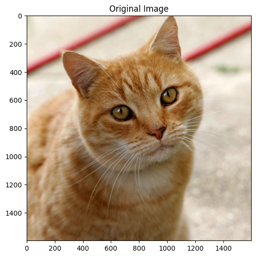


    Image size: (1600, 1598)
    Image mode: RGB

## Load EXECUTORCH Model

> **Note:** You need to export a model first using the `export_mobv2_executorch.py` script.
>
> If you don't have a model yet, run the export script first:
>
>  - `python export_mobv2_executorch.py`
>

Let's verify what the models in the folder `../models`:

    imagenet_labels.json  mobilenet_v2_quantized_xnnpack.pte
    mobilenet_v2.pte      mobilenet_v2_xnnpack.pte
    mobilenet_v2.pth

> The conversions were performed using the Python scripts in the previous sections. 
>

```python
# Load the EXECUTORCH model
model_path = "../models/mobilenet_v2.pte"

try:
    model = _load_for_executorch(model_path)
    print(f"Model loaded successfully from: {model_path}")
    #print(f"  Available methods: {model.method_names}")
    
    # Check file size
    file_size = os.path.getsize(model_path) / (1024 * 1024)  # MB
    print(f"Model size: {file_size:.2f} MB")
    
except FileNotFoundError:
    print(f"✗ Model not found: {model_path}")
    print("\nPlease run the export script first:")
    print("  python export_mobilenet.py")
```

    Model loaded successfully from: ../models/mobilenet_v2.pte
    Model size: 13.58 MB

## Download ImageNet Labels


```python
# Download and save ImageNet labels (if you do not have it)
LABELS_PATH = "../models/imagenet_labels.json"

if not os.path.exists(LABELS_PATH):
    print("Downloading ImageNet labels...")
    LABELS_URL = "https://raw.githubusercontent.com/anishathalye/imagenet-simple-labels/master/imagenet-simple-labels.json"
    with urllib.request.urlopen(LABELS_URL) as url:
        labels = json.load(url)
    
    # Save labels locally
    with open(LABELS_PATH, 'w') as f:
        json.dump(labels, f)
    print(f"Labels saved to {LABELS_PATH}")
else:
    print("Loading labels from disk...")
    with open(LABELS_PATH, 'r') as f:
        labels = json.load(f)      
```

Check the labels:

```python
print(f"\nTotal classes: {len(labels)}")
print(f"Sample labels: {labels[280:285]}")  
```


    Total classes: 1000
    Sample labels: ['grey fox', 'tabby cat', 'tiger cat', 'Persian cat', 'Siamese cat']

## Image Preprocessing

A preprocessing pipeline is needed because ExecuTorch only runs the exported core network; it does not include the input normalization logic that MobileNet v2 expects, and the model will give incorrect predictions if the input tensor is not in the exact format it was trained on.

What MobileNet v2 expects
For typical PyTorch MobileNet v2 models (ImageNet‑pretrained):
	•	Input shape: 3‑channel RGB tensor of size.
	•	Value range: floating-point values, usually in float32 after dividing by 255.
	•	Normalization: per‑channel mean/std (ImageNet) normalization, e.g., `mean=0.485, 0.456, 0.406`, `std=0.229, 0.224, 0.225`.

These steps (resize, convert to tensor, normalize) are not “optional decorations”; they are part of the functional definition of the model’s expected input distribution.

### Define preprocessing pipeline


```python
preprocess = transforms.Compose([
    transforms.Resize(256),              # Resize to 256
    transforms.CenterCrop(224),          # Center crop to 224x224
    transforms.ToTensor(),               # Convert to tensor [0, 1]
    transforms.Normalize(                # Normalize with ImageNet stats
        mean=[0.485, 0.456, 0.406],
        std=[0.229, 0.224, 0.225]
    ),
])
```

### Apply preprocessing


```python
input_tensor = preprocess(img)
print(f"  Input shape: {input_tensor.shape}")
print(f"  Input dtype: {input_tensor.dtype}")
```

      Input shape: torch.Size([3, 224, 224])
      Input dtype: torch.float32

### Add batch dimension: [1, 3, 224, 224]


```python
input_batch = input_tensor.unsqueeze(0)  

print(f"  Input shape: {input_batch.shape}")
print(f"  Input dtype: {input_batch.dtype}")
print(f"  Value range: [{input_batch.min():.3f}, {input_batch.max():.3f}]")
```

      Input shape: torch.Size([1, 3, 224, 224])
      Input dtype: torch.float32
      Value range: [-2.084, 2.309]


The Preprocessing is complete!

## Run Inference

For inference, we should run a forward pass of the model in inference mode (`torch.no_grad()`), measure the time, and print basic information about the outputs.

`torch.no_grad()` is a context manager that disables gradient calculation inside its block. During inference, we do not need gradients, so disabling them:

- Saves memory (no computation graph is stored).
- Can speed up computation slightly.
- Everything computed inside this block will have `requires_grad=False`, so we cannot call `.backward()` on it.


```python
# Run inference
with torch.no_grad():
    start_time = time.time()
    outputs = model.forward((input_batch,))
    inference_time = time.time() - start_time

print(f"Inference completed in {inference_time*1000:.2f} ms")
print(f"Output type: {type(outputs)}")
print(f"Output shape: {outputs[0].shape}")
```

    Inference completed in 2478.74 ms
    Output type: <class 'list'>
    Output shape: torch.Size([1, 1000])


`type(outputs)` tells us what container the model returned. Often this is a tuple or list when working with exported/ExecuTorch‑style models, e.g. `<class 'tuple'>`.

That container may hold one or more tensors (e.g., logits, auxiliary outputs). 

- `outputs[0]` accesses the first element of that container (usually the main output tensor), and `.shape` prints its dimensions (For image classification, this is often `batch_size, num_classes`). 

## Process and Display Results

Now we should take the model’s raw scores (logits) for a single image, convert them into probabilities with softmax, select the top‑5 most likely classes, and print them nicely formatted.

- `outputs[0][0]` selects the first element in the batch, giving a 1D tensor of logits of length `num_classes`.
- `torch.nn.functional.softmax(..., dim=0)` applies the softmax function along that 1D dimension, turning logits into probabilities that sum to 1.


```python
# Apply softmax to get probabilities
probabilities = torch.nn.functional.softmax(outputs[0][0], dim=0)

# Get top 5 predictions
top5_prob, top5_indices = torch.topk(probabilities, 5)

# Display results
print("\n" + "="*60)
print("TOP 5 PREDICTIONS")
print("="*60)
print(f"{'Class':<35} {'Probability':>10}")
print("-"*60)

for i in range(5):
    label = labels[top5_indices[i]]
    prob = top5_prob[i].item() * 100
    print(f"{label:<35} {prob:>9.2f}%")

print("="*60)
```


    ============================================================
    TOP 5 PREDICTIONS
    ============================================================
    Class                               Probability
    ------------------------------------------------------------
    tiger cat                               12.85%
    Egyptian cat                             9.75%
    tabby                                    6.09%
    lynx                                     1.70%
    carton                                   0.84%
    ============================================================

## Create Reusable Classification Function

For simplicity and reuse across other tests, let's create a reusable function that builds on what was done so far. 


```python
def classify_image_executorch(img_path, model_path, labels_path, top_k=5, show_image=True):
    """
    Classify an image using EXECUTORCH model
    
    Args:
        img_path: Path to input image
        model_path: Path to .pte model file
        labels_path: Path to labels text file
        top_k: Number of top predictions to return
        show_image: Whether to display the image
    
    Returns:
        inference_time: Inference time in ms
        top_indices: Indices of top k predictions
        top_probs: Probabilities of top k predictions
    """
    # Load image
    img = Image.open(img_path).convert('RGB')
    
    # Display image
    if show_image:
        plt.figure(figsize=(4, 4))
        plt.imshow(img)
        plt.axis('off')
        plt.title('Input Image')
        plt.show()

    print(f"Image Path: {img_path}")
    
    # Load model
    print(f"Model Path {model_path}") 
    model_size = os.path.getsize(model_path) / (1024 * 1024)
    print(f"Model size: {model_size:6.2f} MB")
    
    model = _load_for_executorch(model_path)

    # Preprocess
    preprocess = transforms.Compose([
        transforms.Resize(256),
        transforms.CenterCrop(224),
        transforms.ToTensor(),
        transforms.Normalize(
            mean=[0.485, 0.456, 0.406],
            std=[0.229, 0.224, 0.225]
        ),
    ])
    
    input_tensor = preprocess(img)
    input_batch = input_tensor.unsqueeze(0)
    
    # Inference
    with torch.no_grad():
        start_time = time.time()
        outputs = model.forward((input_batch,))
        inference_time = (time.time() - start_time)*1000
        
    
    # Process results
    probabilities = torch.nn.functional.softmax(outputs[0][0], dim=0)
    top_prob, top_indices = torch.topk(probabilities, top_k)
    
    # Load labels
    with open(labels_path, 'r') as f:
        labels = json.load(f)
    
    # Display results
    print(f"\nInference time: {inference_time:.2f} ms")
    print("\n" + "="*60)
    print(f"{'[PREDICTION]':<35} {'[Probability]':>15}")
    print("-"*60)
    
    for i in range(top_k):
        label = labels[top_indices[i]]
        prob = top_prob[i].item() * 100
        print(f"{label:<35} {prob:>14.2f}%")
    
    print("="*60)
    
    return inference_time, top_indices, top_prob

print("✓ Classification function defined!")
```

    ✓ Classification function defined!

## Classification Function Test


```python
# Test with the cat image
inf_time, indices, probs = classify_image_executorch(
    img_path="../images/cat.jpg",
    model_path="../models/mobilenet_v2.pte",
    labels_path="../models/imagenet_labels.json",
    top_k=5
)
```

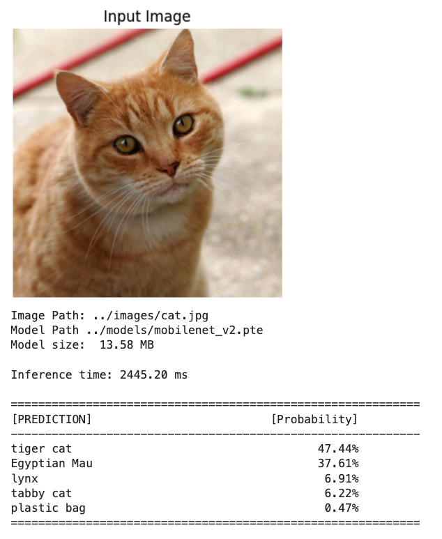
    We can also checks what is retrurned fron the function

```python
inf_time, indices, probs
```


```bash
(2445.200204849243,
 tensor([282, 285, 287, 281, 728]),
 tensor([0.4744, 0.3761, 0.0691, 0.0622, 0.0047]))
```

## Using the XNNPACK accelerated backend

**Note**: We need to export a model using the `convert_mobv2_xnnpack.py` script first.


```python
# Test with the cat image
inf_time, indices, probs = classify_image_executorch(
    img_path="../images/cat.jpg",
    model_path="../models/mobilenet_v2_xnnpack.pte",
    labels_path="../models/imagenet_labels.json",
    top_k=5
)
```


    


`The inference time was reduced from +2.5s to around -20ms`

## Quantized model - XNNPACK accelerated backend

**Note**: We need to export a model first using the ``convert_mobv2_xnnpack_int8.py`` script.


```python
# Test with the cat image
inf_time, indices, probs = classify_image_executorch(
    img_path="../images/cat.jpg",
    model_path="../models/mobilenet_v2_quantized_xnnpack.pte",
    labels_path="../models/imagenet_labels.json",
    top_k=5
)
```

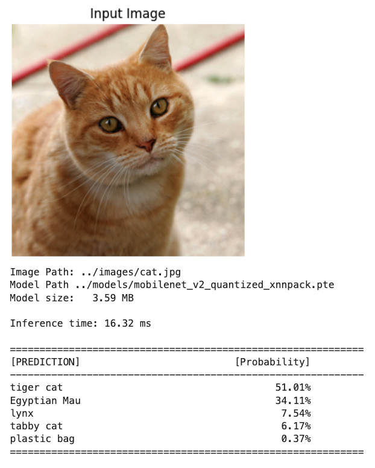
    `==> Even faster inference with a lower model in size`

> Slightly higher probabilities in the INT8 model are normal and do not indicate a problem by themselves. Quantization slightly changes the logits, and softmax can become a bit “sharper” or “flatter” even when top‑1 remains correct.
>

## Camera Integration

We essentially have two different Python worlds: system Python 3.13 (where the camera stack is wired up) and our 3.11 virtual env (where ExecuTorch is installed). To run ExecuTorch on live frames from the Pi camera, we need to bridge those worlds.

> Why the camera “only works” in 3.13
>
> - Recent Raspberry Pi OS uses Picamera2 on top of libcamera as the recommended interface.
> - The Picamera2/libcamera Python bindings are usually installed into the system Python and are not trivially pip‑installable into arbitrary venvs or other Python versions.
> - Once we create a separate 3.11 environment, it will not automatically see the Picamera2/libcamera bindings that live under 3.13, so imports fail, or the camera device is not accessible from that environment.
>

We will use a `two‑process solution`: capture in 3.13, infer in 3.11. For that, we should run a small capture service under Python 3.13 that:

- Grabs frames from the Pi camera (Picamera2 / libcamera).
- Sends frames to your ExecuTorch process (3.11) over a local channel (e.g., ZeroMQ, TCP/UDP socket, shared memory, filesystem (write JPEG/PNG to a temp directory and signal), or a simple HTTP server.

The 3.11 process (under venev) receives the frame, decodes it, runs the preprocessing pipeline (resize, normalize), then calls ExecuTorch for inference.. 

### Image Capture

Outside of the ExecuTorch env and folder, we will create a folder (`CAMERA`). 

```
Documents/
├── EXECUTORCH/MOBILENET/     # Python 3.11
├── CAMERA/                   # Python 3.13
       ├── camera_capture.py
       ├── camera_capture.jpg
```

There we will run the script [camera_capture.py](https://github.com/Mjrovai/EdgeML-with-Raspberry-Pi/blob/main/EXECUTORCH/scripts/camera_capture.py)):

```python
import numpy as np
from picamera2 import Picamera2
import time

print(f"NumPy version: {np.__version__}")

# Initialize camera

picam2 = Picamera2()

config = picam2.create_preview_configuration(main={"size":(640,480)}) 
picam2.configure(config)
picam2.start()

# Wait for camera to warm up

time.sleep(2)

print("Camera working in isolated venv!")

# Capture image

picam2.capture_file("camera_capture.jpg")
print("Image captured: camera_capture.jpg")

# Stop camera

picam2.stop()
picam2.close()
```

Runing the script, we um get an image that will be stored on:

- `/Documents/CAMERA/camera_capture.jpg`

Looking from the notebook folder, the image path will be:


```python
../../../../CAMERA/camera_capture.jpg
```

Let's run the same function used with the test image:

```python
# Test the quantized model with the captured image
inf_time, indices, probs = classify_image_executorch(
    img_path="../../../../CAMERA/camera_capture.jpg",
    model_path="../models/mobilenet_v2_quantized_xnnpack.pte",
    labels_path="../models/imagenet_labels.json",
    top_k=5
)
```


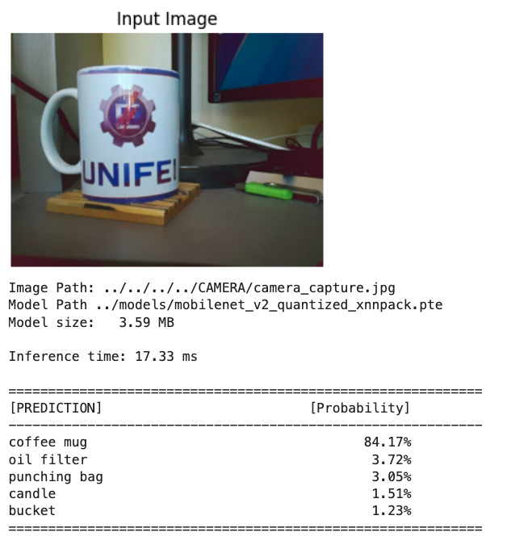

## Performance Benchmarking

Let's now define a function to run the inference several times for each one of the models to compare their performance. 


```python
def benchmark_inference(model_path, num_runs=50):
    """
    Benchmark model inference speed
    """
    print(f"Benchmarking model: {model_path}")
    print(f"Number of runs: {num_runs}\n")
    
    # Load model
    model = _load_for_executorch(model_path)
    
    # Create dummy input
    dummy_input = torch.randn(1, 3, 224, 224)
    
    # Warmup (10 runs)
    print("Warming up...")
    for _ in range(10):
        with torch.no_grad():
            _ = model.forward((dummy_input,))
    
    # Benchmark
    print(f"Running benchmark...")
    times = []
    for i in range(num_runs):
        start = time.time()
        with torch.no_grad():
            _ = model.forward((dummy_input,))
        times.append(time.time() - start)
    
    times = np.array(times) * 1000  # Convert to ms
    
    # Print statistics
    print("\n" + "="*50)
    print("BENCHMARK RESULTS")
    print("="*50)
    print(f"  Mean:   {times.mean():.2f} ms")
    print(f"  Median: {np.median(times):.2f} ms")
    print(f"  Std:    {times.std():.2f} ms")
    print(f"  Min:    {times.min():.2f} ms")
    print(f"  Max:    {times.max():.2f} ms")
    print("="*50)
    
    # Plot distribution
    plt.figure(figsize=(12, 4))
    
    # Histogram
    plt.subplot(1, 2, 1)
    plt.hist(times, bins=20, edgecolor='black', alpha=0.7)
    plt.axvline(times.mean(), color='red', linestyle='--', 
                label=f'Mean: {times.mean():.2f} ms')
    plt.xlabel('Inference Time (ms)')
    plt.ylabel('Frequency')
    plt.title('Inference Time Distribution')
    plt.legend()
    plt.grid(alpha=0.3)
    
    # Time series
    plt.subplot(1, 2, 2)
    plt.plot(times, marker='o', markersize=3, alpha=0.6)
    plt.axhline(times.mean(), color='red', linestyle='--', 
                label=f'Mean: {times.mean():.2f} ms')
    plt.xlabel('Run Number')
    plt.ylabel('Inference Time (ms)')
    plt.title('Inference Time Over Runs')
    plt.legend()
    plt.grid(alpha=0.3)
    
    plt.tight_layout()
    plt.show()
    
    return times
```

To recal, we have the folowing converted models:

    mobilenet_v2.pte     
    mobilenet_v2_xnnpack.pte
    mobilenet_v2_quantized_xnnpack.pte

### Basic (Float32): mobilenet_v2.pte


```python
# Run benchmark
benchmark_times = benchmark_inference(
    model_path="../models/mobilenet_v2.pte",
    num_runs=50
)
```


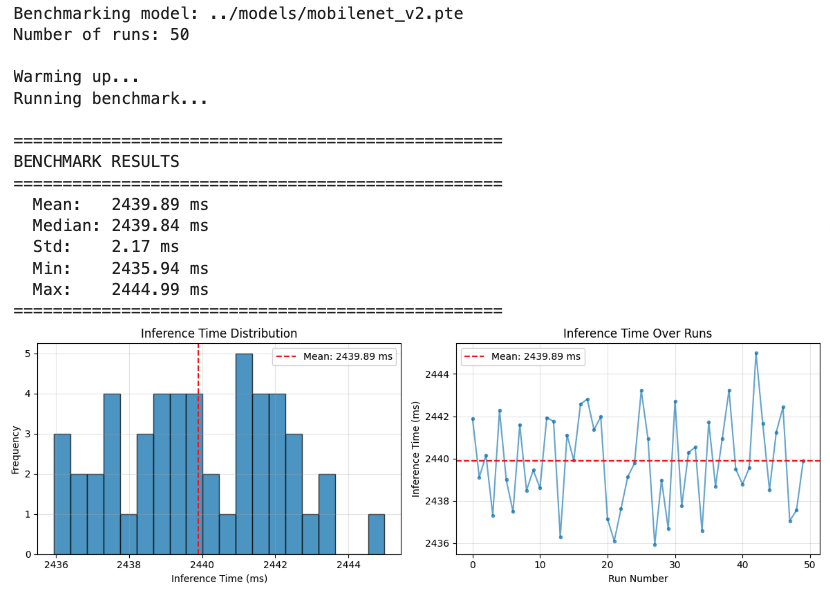    

### XNNPACK Backend (Flot32): mobilenet_v2_xnnpack.pte


```python
# Run benchmark
benchmark_times = benchmark_inference(
    model_path="../models/mobilenet_v2_xnnpack.pte",
    num_runs=50
)
```


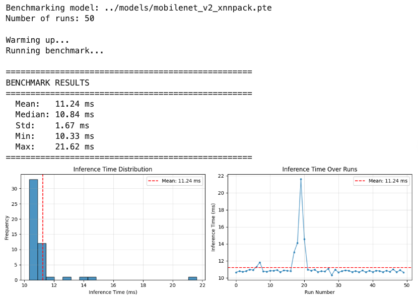

### Quantization (INT8): mobilenet_v2_quantized_xnnpack.pte


```python
# Run benchmark
benchmark_times = benchmark_inference(
    model_path="../models/mobilenet_v2_quantized_xnnpack.pte",
    num_runs=50
)
```

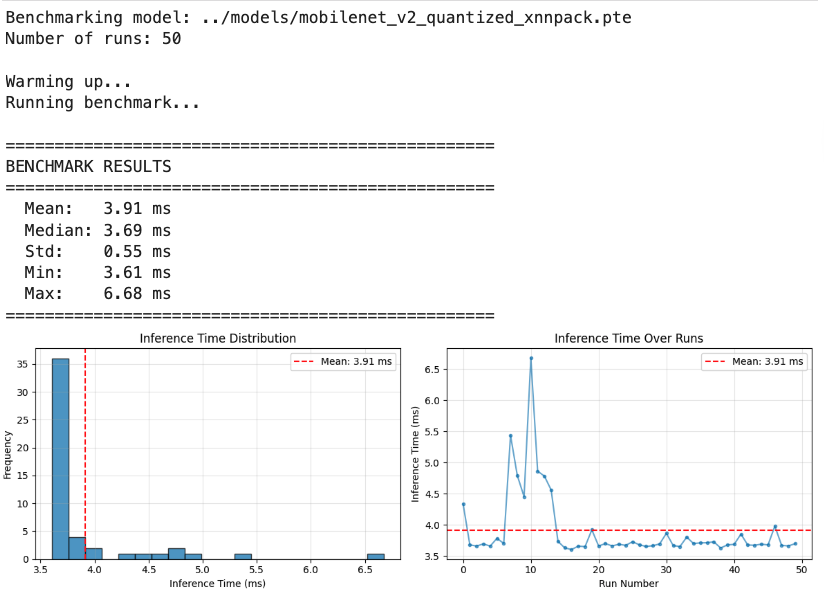

### Performance Comparison Table

Based on actual benchmarking results on Raspberry Pi 5:

| Model Configuration | Mean (ms) | Median (ms) | Std Dev (ms) | File Size (MB) | Latency |
| ------------------- | --------- | ----------- | ------------ | -------------- | ------- |
| Float32 (basic)     | 2440      | 2440        | 2.17         | 13.58          | +600×   |
| Float32 + XNNPACK   | 11.24     | 10.84       | 1.67         | 13.35          | ~3×     |
| INT8 + XNNPACK      | 3.91      | 3.69        | 0.55         | 3.59           | 1×      |

**Key Observations:**

1. **XNNPACK Impact**: Backend delegation provides ~3.8× speedup even without quantization
2. **Quantization Benefit**: INT8 quantization adds ~30% additional speedup beyond XNNPACK
3. **Variability**: Quantized model shows lower standard deviation, indicating more stable performance
4. **Size-Speed Tradeoff**: 75% size reduction (14MB → 3.5MB) with 5× speed improvement

## Exploring Custom Models

**CIFAR-10 Dataset:** 

- 10 classes: airplane, automobile, bird, cat, deer, dog, frog, horse, ship, truck


- The images in CIFAR-10 are of size 3x32x32 (3-channel color images of 32x32 pixels in size).

### Exporting a Custom Trained Model

Let's create a Project folder structure as below (some files are shown as they will appear later)

```
EXECUTORCH/CIFAR-10/
├── export_cifar10_xnnpack.py
├── inference_cifar10_xnnpack.py       
├── models/
│   ├── cifar10_model_jit.pt                    # Float32 pytorch model
│   └── cifar10_xnnpack.pte                     # Float32 conv model
├── images/                                     # Test images
│   └── cat.jpg
└── notebooks/                                   
    └── CIFAR-10_Inference_RPI.ipynb
```

Let's train a model from scratch on CIFAR-10. For that, we can run the Notebook below on Google Colab:

[cifar10_colab_training.ipynb](https://github.com/Mjrovai/EdgeML-with-Raspberry-Pi/blob/main/EXECUTORCH/notebooks/cifar10_colab_training.ipynb)

From the training, we will have the trained model:

`cifar10_model_jit.pt`, which should be saved on `/models` folder

Next, as we did before, we should export the PyTorch model to ExecuTorch, and let's use XNNPACK. Run the script: [export_cifar10_xnnpack.py](https://github.com/Mjrovai/EdgeML-with-Raspberry-Pi/blob/main/EXECUTORCH/notebooks/cifar10_colab_training.ipynb), as a result, we have:

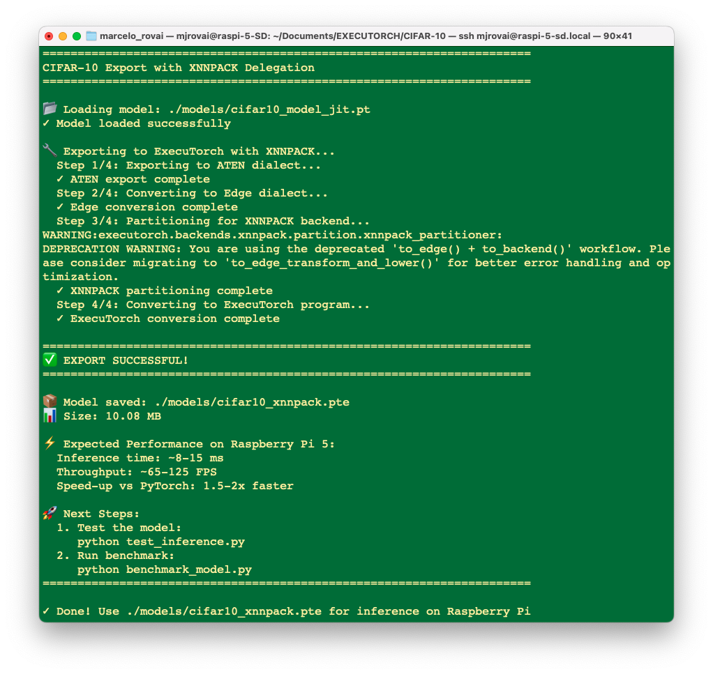

Runing it, a converted model `cifar10_xnnpack.pte` will be saved in `./models/` folder. 

### Running Custom Models on Raspberry Pi

Runing the script [inference_cifar10_xnnpack.py](https://github.com/Mjrovai/EdgeML-with-Raspberry-Pi/blob/main/EXECUTORCH/scripts/inference_cifar10_xnnpack.py), over the "cat" image, we can see that the converted model is working fine:

`python inference_cifar10_xnnpack.py ./images/cat.jpg`

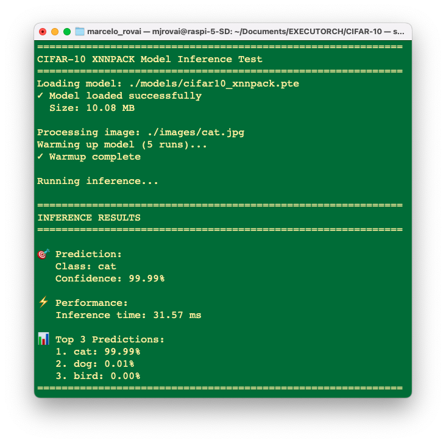

And runing 20 times....

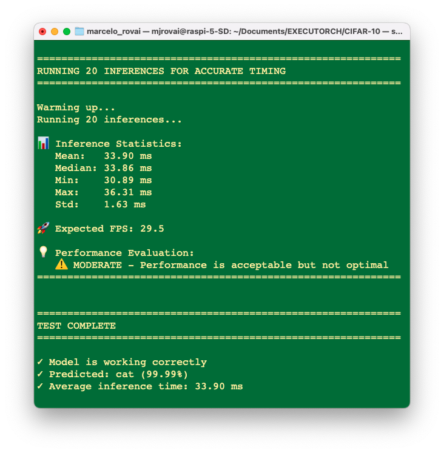

Despite the fact that the exported model is OK, if we make an inference with the original PyTorch model, in this particular case (a small model), we will find even lower latencies. 

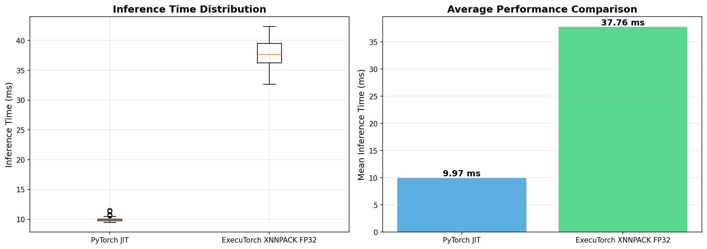

In short, our export script is conceptually the right pattern for ExecuTorch+XNNPACK on Arm, but for this specific small CIFAR‑10 CNN, the overhead of ExecuTorch and partial XNNPACK delegation on a Pi‑class device can easily make it slower than a well‑optimized plain PyTorch JIT model. 

Optionally, it is possible to explore those models with the notebook: 

`CIFAR-10_Inference_RPI_Updated.ipynb`

---

## Conclusion

This chapter adapted our image classification workflow from TensorFlow Lite to PyTorch EXECUTORCH, demonstrating that the PyTorch ecosystem provides a powerful and modern alternative for edge AI deployment on Raspberry Pi devices.

EXECUTORCH represents a significant evolution in edge AI deployment, bringing PyTorch's research-friendly ecosystem to production edge devices. While TensorFlow Lite remains excellent and mature, having EXECUTORCH in your toolkit makes you a more versatile edge AI practitioner.

The future of edge AI is multi-framework, multi-platform, and rapidly evolving. By mastering both EXECUTORCH and TensorFlow Lite, you're positioned to make informed technical decisions and adapt as the landscape changes.

> **Remember:** The best framework is the one that serves your specific needs. This tutorial empowers you to make that choice confidently.

### Key Takeaways

**Technical Achievements:**

- Successfully set up PyTorch and EXECUTORCH on Raspberry Pi (4/5)
- Learned the complete model export pipeline from PyTorch to .pte format
- Implemented quantization for reduced model size (~3.5MB vs ~14MB)
- Created reusable inference functions for both standard and custom models
- Integrated camera capture with EXECUTORCH inference

**EXECUTORCH Advantages:**
- **Unified ecosystem**: Training and deployment in the same framework
- **Modern architecture**: Built for contemporary edge computing needs
- **Flexibility**: Easy export of any PyTorch model
- **Quantization**: Native PyTorch quantization support
- **Active development**: Continuous improvements from Meta and the community

**Comparison with TFLite:**
Both frameworks achieve similar goals with different philosophies:

- **EXECUTORCH**: Better for PyTorch users, newer technology, growing ecosystem
- **TFLite**: More mature, broader hardware support, larger community

The choice between them often comes down to your training framework and specific requirements.

### Performance Considerations

On Raspberry Pi 4/5, you can expect:
- **Float32 models**: 10-20ms per inference (MobileNet V2)

- **Quantized models**: 3-5ms per inference

- **Memory usage**: 4-15MB, depending on model size

    ---

    ## Resources

    ### Code Repository

    - [Tutorial Code Repository](https://github.com/Mjrovai/EdgeML-with-Raspberry-Pi/tree/main/EXECUTORCH)
    - [Model Export and Inference Scripts](https://github.com/Mjrovai/EdgeML-with-Raspberry-Pi/tree/main/EXECUTORCH/scripts)
    - [Notebooks](https://github.com/Mjrovai/EdgeML-with-Raspberry-Pi/tree/main/EXECUTORCH/notebooks)
    
    ### Official Documentation
    
    **PyTorch & EXECUTORCH:**

    - [PyTorch Official Website](https://pytorch.org/)
    - [EXECUTORCH Documentation](https://pytorch.org/executorch/)
    - [EXECUTORCH GitHub Repository](https://github.com/pytorch/executorch)
    - [PyTorch Mobile](https://pytorch.org/mobile/)
    - [Deep Learning with PyTorch: A 60 Minute Blitz](https://docs.pytorch.org/tutorials/beginner/deep_learning_60min_blitz.html)
    
    **Quantization:**
    
    - [PyTorch Quantization](https://pytorch.org/docs/stable/quantization.html)
    - [Quantization API Tutorial](https://pytorch.org/tutorials/advanced/static_quantization_tutorial.html)

    **Models:**

    - [Torchvision Models](https://pytorch.org/vision/stable/models.html)
    - [Pretrained Model Deployment Guide](https://pytorch.org/executorch/stable/tutorials/export-to-executorch-tutorial.html)
    
    ### Hardware Resources

    - [Raspberry Pi Official Documentation](https://www.raspberrypi.com/documentation/)
    - [Picamera2 Library](https://github.com/raspberrypi/picamera2)
    - [ARM Architecture Optimization](https://developer.arm.com/)
    
    ### Books

    - [**Edge AI Engineering e-book**](https://mjrovai.github.io/EdgeML_Made_Ease_ebook/)- by Prof. Marcelo Rovai, UNIFEI
    - [**Machine Learning Systems**](https://mlsysbook.ai/book/) - by Prof. Vijay Janapa Reddi, Harvard University
    - [**AI and ML for Coders in PyTorch**](https://learning.oreilly.com/library/view/ai-and-ml/9781098199166/) by Laurence Moroney
    
    ---

    **Tutorial Credits**

    **Author:** Prof. Marcelo Rovai  
    **Affiliation:** Federal University of Itajubá (UNIFEI), Brazil  
    **Role:** Co-Chair, TinyML4D Academic Network and EAIP (Edge AI Foundation Industry Academia Partnership)
    
    **License:** Open-source educational material  
    **Repository:** https://github.com/Mjrovai/EdgeML-with-Raspberry-Pi/tree/main/EXECUTORCH

    ---
    
    **Acknowledgments**

    - Meta AI and the PyTorch team for developing EXECUTORCH
    - The Raspberry Pi Foundation for excellent hardware and documentation
    - The TinyML and EdgeAI community for continuous inspiration and support
    - UNIFEI students for feedback and testing
    
    **Version:** 1.0  
    **Last Updated:** January 2025  
    **Contact:** [mjrovai@gmail.com](mailto:mjrovai@gmail.com)
    
    ---
    
    *"Democratizing Edge AI education: **Knowledge should be accessible to everyone, everywhere.***"

