# Beyond CPU - Hardware Acceleration for Edge AI

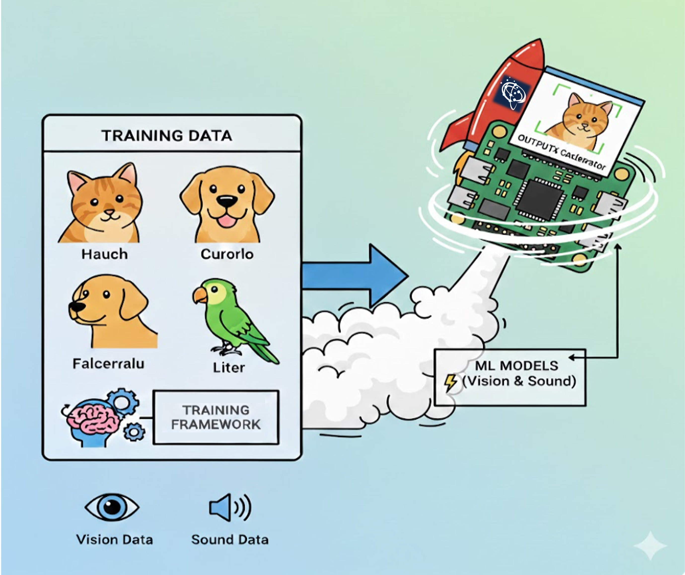

*Hardware Acceleration with MemryX MX3 on Raspberry Pi 5.*

## Introduction

Throughout this course, we've explored various approaches to deploying AI models at the edge. We started with TensorFlow Lite running on the Raspberry Pi's CPU, then moved to YOLO and ExecuTorch with optimized backends like XNNPACK. While these software optimizations significantly improve performance, they still rely on the general-purpose CPU to execute neural network operations.

In this chapter, we'll take the next step: **dedicated hardware acceleration**. We'll use the [MemryX MX3 M.2 AI Accelerator Module](https://memryx.com/wp-content/uploads/2025/04/MX3-M.2-AI-Accelerator-Module-Product-brief-DEC25-Gold.pdf)—a specialized processor designed specifically for neural network inference. The MX3 module contains four AI accelerator chips that can run deep learning models with dramatically lower latency and power consumption compared to CPU execution.

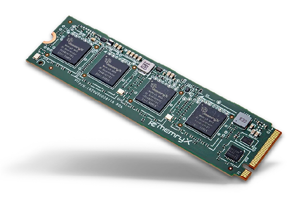{width=65% fig-align="center"}

### Why Hardware Acceleration?

Consider the requirements for real-time edge AI applications:
- **Latency**: Autonomous systems need predictions in milliseconds
- **Power efficiency**: Battery-powered devices must conserve energy
- **Throughput**: Multi-camera systems may need to process several streams simultaneously
- **Cost**: System designs often cannot afford high-end GPUs

The MX3 addresses these challenges with a unique architecture:
- **At-memory computing**: All memory is integrated on the accelerator, eliminating bandwidth bottlenecks
- **Pipelined dataflow**: Optimized for streaming inputs with a batch size of 1
- **Floating-point accuracy**: No quantization required (though supported)
- **Low power**: Maximum 10W for four accelerator chips

> For learning more about AI Acceleration, please refer to [MLSys book](https://mlsysbook.ai/book/contents/core/hw_acceleration/hw_acceleration.html) and how the MemryX module works, read the [Architecture Overview](https://developer.memryx.com/architecture/architecture.html).

### Our goal

By the end of this lab, we will have installed and configured the MX3 hardware on a Raspberry Pi 5, set up the MemryX SDK and development environment, and gained a clear understanding of the MX3 compilation and deployment workflow. We will also compile neural network models for execution on the MX3 accelerator, compare their performance against CPU-based inference while analyzing the trade-offs, and finally build a complete end-to-end inference pipeline using the MemryX Python API.

## Hardware Installation and Verification

### Prerequisites

Before starting this lab, we should have:

**Raspberry Pi 5 with M.2 HAT+ adapter** (or similar)

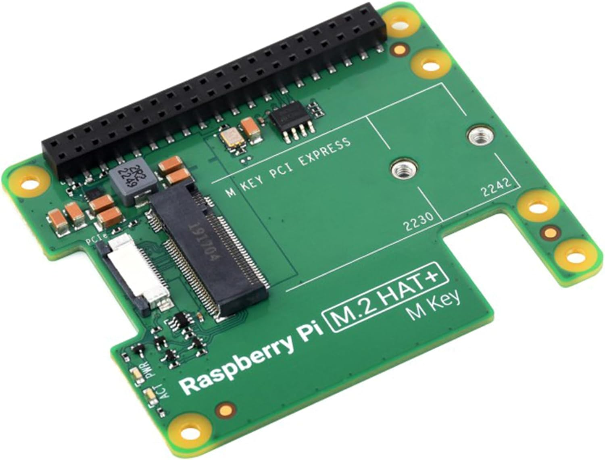{width=65% fig-align="center"}


> **IMPORTANT NOTE**: MemryX recommends the [GeeekPi N04 M.2 2280 HAT](https://www.amazon.com/GeeekPi-NVMe-Adapter-Raspberry-Support/dp/B0CRK4YB4C) as an excellent choice for the Raspberry Pi 5. It delivers solid power and fits the 2280 MX3 M.2 form factor. Some hats can lead to instabilities, mainly due to PCIe speed (Gen3).  The Raspberry Pi 5 can have stability issues on Gen3.  

The [Raspberry Pi M.2 HAT+](https://www.amazon.com/dp/B0D5CGDJLQ?tag=consecho57301-20&linkCode=osi&th=1&psc=1&ascsubtag=NoCID|da83d918-3f4e-415e-ad00-b1791332db69) is a good option. It works very well, despite the fact that we should adapt the MX3 board to it (The MX3 is longer than the hat).

**MemryX MX3 M.2 module with the heatsink installed** 

For heatsink installation, follow the video instructions: https://youtu.be/wNmka0nrRRE 

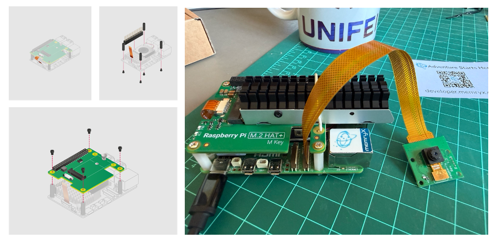{width=95% fig-align="center"}

### Installation and Cooling Considerations

 It is essential to ensure we have sufficient cooling for the MemryX MX3 M.2 module, or we may experience thermal throttling and reduced performance. **The chips will throttle their performance if they hit 100 °C**.

During normal operation, the current MemryX MX3 temperature and throttle status can be viewed at any time with:

```bash
cat /sys/memx0/temperature
```

Or measurd continuay every 1 second, for example with the command:

```bash
watch -n 1 cat /sys/memx0/temperature
```

### Verification

After installing the hardware, turn on the Raspberry Pi and verify the system setup.

```bash
ls /dev/memx*
```

It should return: `/dev/memx0`

If the device is not detected, see the [Troubleshooting section](#troubleshooting-common-issues) below.

Let's also check the initial temperature:

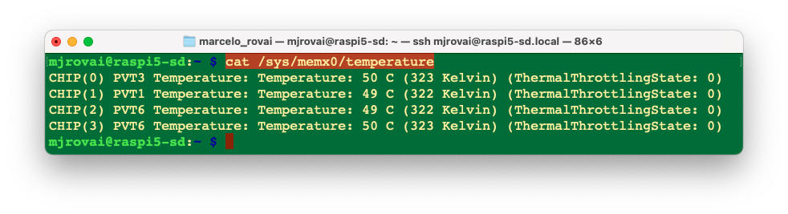

> The lab temperature at the time of the above measurement was 25 °C. 

## Software Installation

### Create Project Directory

First, we should create a project directory:

```bash
cd Documents
mkdir MEMRYX
cd MEMRYX
```

### Python Version Management with Pyenv

Verify your Python version:

```bash
python --version 
```

If using the latest Raspberry Pi OS (based on Debian Trixie), it should be:

`Python 3.13.5`

Or, if the OS is the Legacy version:

`Python 3.11.2` 

**Important**: As of January 2026, MemryX officially supports only [**Python 3.09 to 3.12**](https://developer.memryx.com/release_notes.html#general). Python 3.13.5 is too new and will likely cause compatibility issues. Since **Debian Trixie ships with Python 3.13** by default, we'll need to install a compatible Python version alongside it. 

One solution is to install [Pyenv](https://github.com/pyenv/pyenv), which allows us to easily manage multiple Python versions for different projects without affecting the system Python.

> If the Raspberry Pi OS is the legacy version, the Python version should be 3.11, and it is not necessary to install Pyenv.

#### Installing Pyenv on Debian Trixie

If you need to install Pyenv on Debian Trixie, follow these steps:

```bash
# Install dependencies
sudo apt install -y make build-essential libssl-dev zlib1g-dev \
libbz2-dev libreadline-dev libsqlite3-dev wget curl llvm \
libncursesw5-dev xz-utils tk-dev libxml2-dev libxmlsec1-dev \
libffi-dev liblzma-dev

# Install pyenv
curl https://pyenv.run | bash

# Add to ~/.bashrc
echo 'export PYENV_ROOT="$HOME/.pyenv"' >> ~/.bashrc
echo 'command -v pyenv >/dev/null || export PATH="$PYENV_ROOT/bin:$PATH"' >> ~/.bashrc
echo 'eval "$(pyenv init -)"' >> ~/.bashrc

# Reload shell
source ~/.bashrc

# Install Python 3.11.14
pyenv install 3.11.14
```

This process takes several minutes as it compiles Python from source.

#### Set Python Version for Project

Once Pyenv and the selected Python version are installed, define it **for the project directory:**

```bash
pyenv local 3.11.14
```

Checking the Python version again, we should see: `Python 3.11.14`.

### MemryX Drivers and SDK Installation

The MemryX software stack consists of two main components:

- **Drivers** (`memx-drivers`): Kernel-level drivers for PCIe communication with the accelerator hardware
- **SDK** (`memx-accl`): Python libraries, neural compiler, runtime, and benchmarking tools

#### Prepare the System

Install the Linux kernel headers required for driver compilation:

```bash
sudo apt install linux-headers-$(uname -r)
```

#### Add MemryX Repository and Key

This command downloads the repository's GPG key for package verification and adds the MemryX package repository:

```bash
wget -qO- https://developer.memryx.com/deb/memryx.asc | sudo tee /etc/apt/trusted.gpg.d/memryx.asc >/dev/null

echo 'deb https://developer.memryx.com/deb stable main' | sudo tee /etc/apt/sources.list.d/memryx.list >/dev/null
```

#### Update and Install Drivers and SDK

```bash
sudo apt update
sudo apt install memx-drivers memx-accl
```

#### Configure Platform Settings

Run the ARM setup utility to configure platform-specific settings. This opens a menu to select the platform and apply the necessary configurations (e.g., enabling PCIe Gen 3.0 on the Raspberry Pi 5):

```bash
sudo mx_arm_setup
```

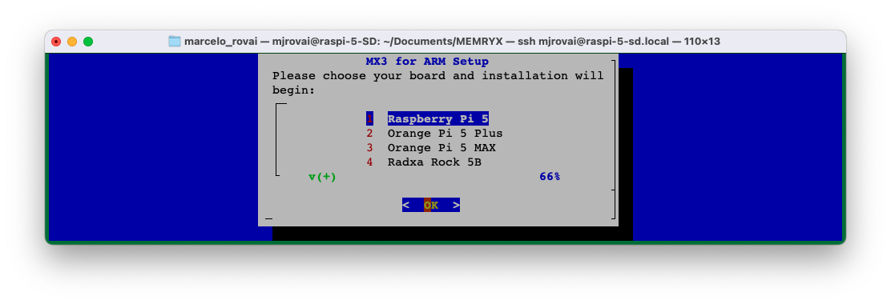

Select the appropriate option for your hardware, and press `<OK> ` in the next page:

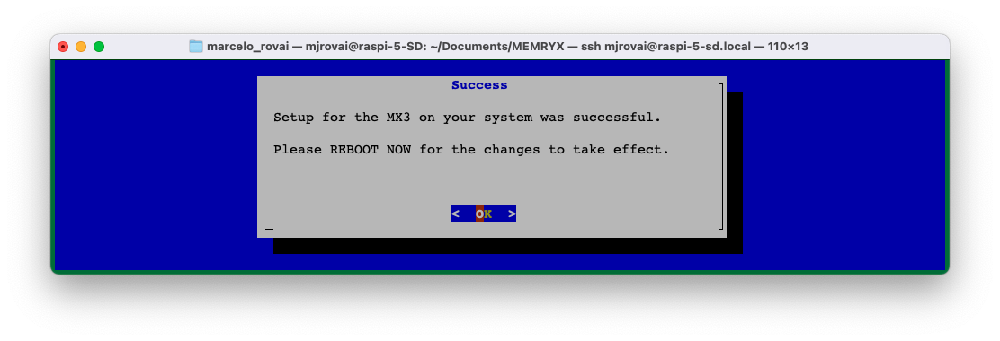

After configuration, reboot the system:

```bash
sudo reboot
```

#### Verify Driver Installation

After rebooting, verify that the MemryX driver is installed by checking its version:

```bash
apt policy memx-drivers
```

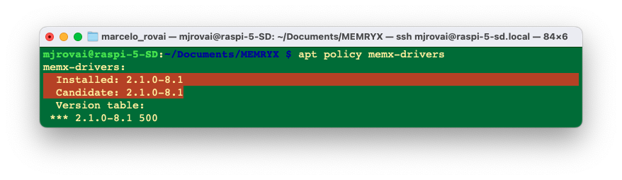

#### Install Utilities

Install additional utilities including GUI tools and plugins:

```bash
sudo apt install memx-accl-plugins memx-utils-gui
```

#### Prepare System Dependencies

Install system libraries required for the Python SDK:

```bash
sudo apt update
sudo apt install libhdf5-dev python3-dev cmake python3-venv build-essential
```

### Install Tools (Inside Virtual Environment)

It's best practice to use a virtual environment to avoid conflicts with system packages.

Create and activate a virtual environment:

```bash
python -m venv mx-env
source mx-env/bin/activate
```

Inside the environment, install the MemryX Python package:

```bash
pip3 install --upgrade pip wheel
pip3 install --extra-index-url https://developer.memryx.com/pip memryx
```

Verify the neural compiler is installed:

```bash
mx_nc --version
```

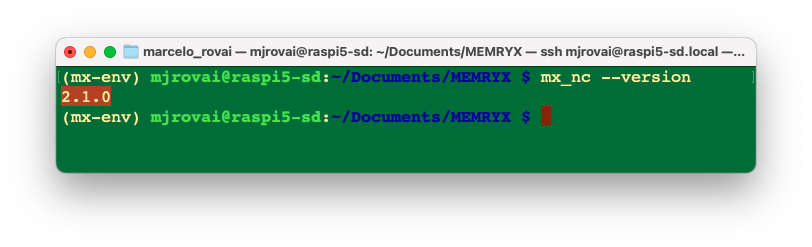

### Verification

Verify the complete installation by running the built-in "hello world" benchmark:

```bash
mx_bench --hello
```

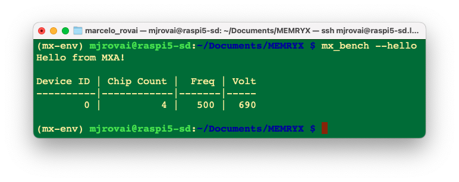

With the benchmark results, our MemryX MX3 is properly installed and ready to use.

## Our First Accelerated Model

### Understanding the MX3 Workflow

Working with the MemryX MX3 follows a straightforward four-step workflow that differs from traditional CPU-based inference:

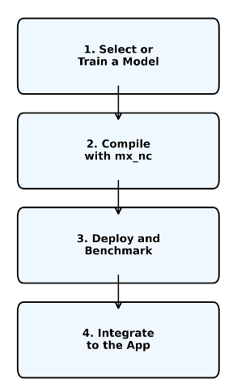{width=65% fig-align="center"}

#### Step 1: Select or Train a Model

Start with a pre-trained model or train your own. MemryX supports models from major frameworks:

- **TensorFlow/Keras** (.h5, SavedModel)
- **ONNX** (.onnx) 
- **PyTorch** (.pt, .pth) (Should be converted to ONNX first)
- **TensorFlow Lite** (.tflite)

The model remains in its original format—no framework-specific conversions needed yet. For this lab, we're using MobileNetV2 from Keras Applications, but we could equally use a custom model we have trained for a specific task, as we have seen before.

**Supported Operations**: The MX3 supports most common deep learning operators (convolutions, pooling, activations, etc.). Check the [supported operators](https://developer.memryx.com/specs/operators/operators.htmll) if using custom architectures. Unsupported operations will fall back to CPU, though this is rare for standard vision models.

#### Step 2: Compile with Neural Compiler

The MemryX Neural Compiler (`mx_nc`) transforms the model into a DFP (Dataflow Package):

```bash
mx_nc [options] -m <model_file>
```

The MemryX Neural Compiler, [mx_nc](https://developer.memryx.com/tools/neural_compiler.html), is a command‑line tool that takes one or more neural‑network models (Keras, TensorFlow, TFLite, ONNX, etc.) and compiles them into a MemryX Dataflow Program (DFP) that can run on MemryX accelerators (MXA).  Internally, it does framework import, graph optimization (fusion/splitting, operator expansion, activation approximation), resource mapping on the MXA cores, and finally emits the DFP used by the runtime or simulator.

**What `mx_nc` does:**

- Compiles models into a single DFP file per compilation, then loads it onto one or more MXA chips to run inference.

- Supports multi‑model, multi‑stream, and multi‑chip mapping, automatically distributing models and layers across available MX3 devices for higher throughput.

- Handles mixed‑precision weights (per‑channel 4/8/16‑bit) while keeping activations in floating point on the accelerator. By default, MemryX quantizes weights to INT8 precision and activations to BFloat16.

- Can crop pre/post‑processing parts of the graph so the MXA focuses on the core CNN/ML operators while the host CPU runs the cropped sections.

**What happens during compilation?**

1. **Model parsing**: Loads the model and extracts the computational graph
2. **Graph optimization**: Fuses operations, eliminates redundancies
3. **Operator mapping**: Maps each layer to MX3 hardware instructions
4. **Dataflow scheduling**: Determines optimal execution order for pipelined processing
5. **Memory allocation**: Assigns on-chip memory for all intermediate activations
6. **Multi-chip distribution**: If using multiple chips, partitions the workload

The compiler is surprisingly tolerant—most models compile without any modifications. If a layer isn't supported, you'll get a clear error message indicating which operation failed.

**Key command‑line options (high level)**

- Model specification:  
  - `-m` / `--models` – input model file(s) (e.g. `.h5`, `.pb`, `.onnx`, TFLite).  
  - Multi‑model example: `mx_nc -v -m model_0.h5 model_1.onnx`.  

- Input shapes:  
  - `-is`, `--input_shapes` – specify input shape(s) when they cannot be inferred, always in NHWC order (e.g. `"224,224,3"`).
  - Supports `"auto"` for models where shapes can be inferred: `-is "auto" "300,300,3"`.

- Cropping / pre‑ and post‑processing control:  
  - `--autocrop` – experimental automatic cropping of pre/post‑processing layers. See the YOLOv8 example further in this chapter.
  - `--inputs`, `--outputs` – manually set which graph nodes are treated as the MXA inputs/outputs; everything outside is cropped to run on the host.
  - For multi‑model graphs, inputs/outputs of different models are separated with `|` (vertical bar). 
  - `--model_in_out` – JSON file describing model inputs/outputs for more complex single or multi‑model cases.

- Multi‑chip / system sizing:  
  - `-c` – number of MXA chips; `-c 2` means compile for two chips and distribute workload across them.

- Diagnostics / verbosity:  
  - `-v`, `-vv`, etc. – increase verbosity, useful to inspect graph transformations and cropping decisions.

- Extensions / unsupported patterns:  
  - `--extensions` – load Neural Compiler Extensions (`.nce` files or builtin names) to add or patch graph handling (e.g., complex transformer subgraphs or unsupported ops) without a new SDK release.

> For the complete option list (including less common flags), run `mx_nc -h` or consult the [Neural Compiler](https://developer.memryx.com/tools/neural_compiler.html) page in the MemryX Developer Hub, which documents all arguments and includes usage examples for single‑model, multi‑model, cropping, and mixed‑precision flows.
>

**Compilation time** varies by model complexity:
- Small models (MobileNet): ~30 seconds
- Medium models (ResNet50): ~2 minutes  
- Large models (EfficientNet): ~5 minutes

Once compiled, the DFP file is portable across all MX3 hardware.

#### Step 3: Deploy and Benchmark

Before integrating into our application, we can verify performance with the benchmarking tool:

```bash
mx_bench -d <dfp_file> -f <num_frames>
```

The benchmarker:
- Generates synthetic input data matching the model's input shape
- Runs warm-up inferences to stabilize performance
- Measures throughput (FPS), latency, and chip utilization
- Reports first-inference latency (includes loading overhead)

**Why benchmark separately?** Real-world applications involve preprocessing (image loading and resizing) and postprocessing (parsing outputs). Benchmarking isolates pure inference performance, letting to identify bottlenecks in our full pipeline.

#### Step 4: Integrate into the Application

Finally, integrate the accelerator into our Python application using the MemryX API:

```python
from memryx import SyncAccl  # or AsyncAccl for concurrent processing

# Initialize accelerator with our DFP
accl = SyncAccl(dfp="model.dfp")

# Run inference
output = accl.run(input_data)

# Process results
# ...

# Clean up
accl.shutdown()
```

**Synchronous vs. Asynchronous APIs**:

- `SyncAccl`: Blocking calls, simple to use, good for single-stream processing
- `AsyncAccl`: Non-blocking, better for multi-stream or real-time applications

The API handles all hardware communication, memory transfers, and scheduling. Our code just provides input tensors and receives output tensors—the complexity is abstracted away.

#### Complete Workflow Example

Let's see the four steps in action with MobileNetV2:

```bash
# Step 1: Get a model (already trained)
python3 -c "import tensorflow as tf; tf.keras.applications.MobileNetV2().save('mobilenet_v2.h5');"

# Step 2: Compile to DFP
mx_nc -v -m mobilenet_v2.h5

# Step 3: Benchmark
mx_bench -d mobilenet_v2.dfp -f 1000

# Step 4: Integrate (see full Python script in next section)
python run_inference_mobilenetv2.py
```

This workflow is remarkably consistent across models and use cases. Once we've done it for one model, adapting to others is straightforward.

> **Key Takeaway**: The MX3 workflow separates compilation (done once) from inference (done repeatedly). This "compile-once, run-many" approach means the optimization overhead is amortized over thousands or millions of inferences in production.

### Download and Compile MobileNetV2

In Keras Applications, we can find deep learning models that are provided with pre-trained weights. These models can be used for prediction, feature extraction, and fine-tuning.

Let's download MobileNetV2, which was used in previous labs:

```bash
python3 -c "import tensorflow as tf; tf.keras.applications.MobileNetV2().save('mobilenet_v2.h5');"
```

The model is saved in the current directory as `mobilenet_v2.h5`.

Next, we will compile the MobileNetV2 model using the MemryX Neural Compiler. This step verifies that both the compiler and the SDK tools are installed and functioning as expected:

```bash
mx_nc -v -m mobilenet_v2.h5
```

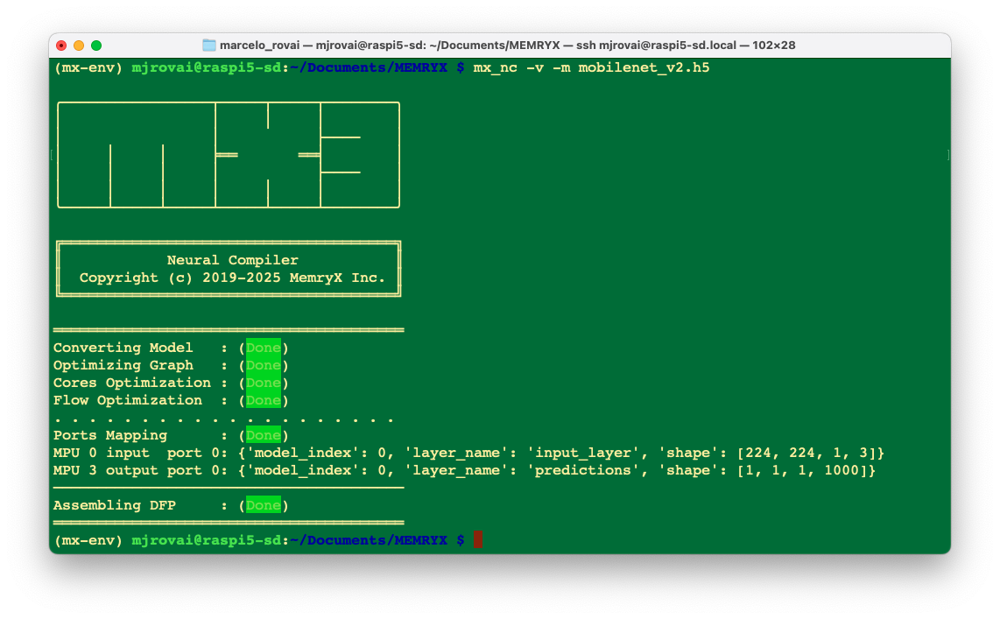

> The compiled model, `mobilenet_v2.dfp`, is saved in the current folder.
>

#### What is a DFP file?

The `.dfp` (Dataflow Package) file is MemryX's proprietary compiled format. Unlike standard model formats (H5, ONNX, etc.) that describe the network architecture, a DFP file contains:

- **Optimized operator graph**: The network restructured for dataflow execution
- **Memory layout**: Pre-calculated memory allocations for at-memory computing
- **Chip mappings**: Instructions for distributing work across the four MX3 accelerators
- **Quantization parameters**: If applicable, the bit-width and scaling factors

The neural compiler (`mx_nc`) performs this transformation automatically, with no manual tuning required. The compilation process:
1. Parses the input model (H5, ONNX, TFLite, etc.)
2. Maps operators to MX3-supported operations
3. Optimizes the dataflow graph
4. Allocates memory on-chip
5. Generates the DFP binary

This is why compilation takes a few minutes, but inference is blazingly fast—all the optimization work happens once, upfront.

### Benchmarking Performance

Now that the model is compiled, it's time to deploy it and run a benchmark to test its performance on the MXA hardware. We will run 1000 frames of random data through the accelerator to measure performance metrics:

```bash
mx_bench -v -d mobilenet_v2.dfp -f 1000
```

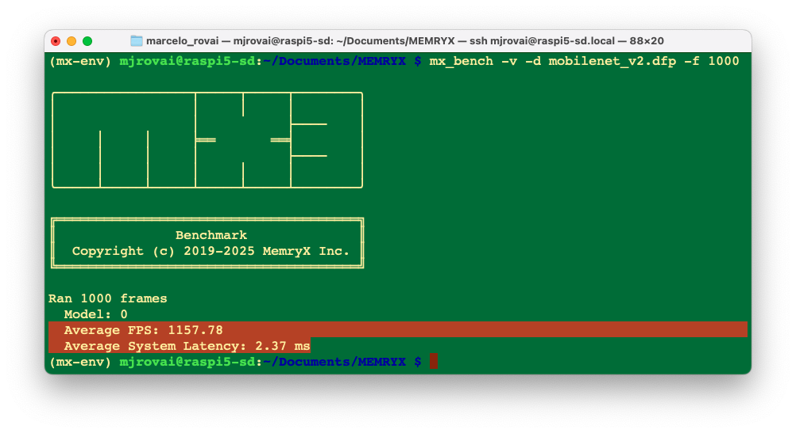

Let's understand what these metrics mean:

- **FPS (Frames Per Second)**: How many images the accelerator can process per second (~1,200 FPS for MobileNetV2)
- **Latency**: Time for a single inference (shown as "Avg" in the output)
  - **Subsequent inferences**: True steady-state performance (~2ms)
- **Throughput**: Total data processed per second 

The benchmark runs with random input data, which is why we see consistent performance. Real-world performance with actual images should be similar once the preprocessing pipeline is optimized, but we have found bigger latency.

> In true dataflow architecture, latency and FPS are not coupled in the traditional sense; latency does not equal 1/FPS. Note that even though latency is ~2ms in the above benchmarking results, FPS is not measured to be 1000 ms / 2 ms = 500 FPS; rather, the FPS from the benchmarking results is ~1160. 

In MemryX’s dataflow architecture, the “usual” rule (`latency = 1/FPS`) only applies to frame‑to‑frame latency, not to end‑to‑end in‑to‑out latency for a single frame.  That is why we see ~2 ms latency per frame, yet still measure around 1160 FPS in MX3 benchmarks.

**Two different latencies**
MemryX explicitly distinguishes two metrics.

- Latency 1 (frame‑to‑frame latency): Time between consecutive outputs once the pipeline is full. Its reciprocal is FPS.
- Latency 2 (full in‑to‑out latency): Time from when the first input frame enters the system (host + MX3 pipeline) until its output appears. This can be larger, but it does not set the FPS.

In a streaming, pipelined accelerator like MX3, multiple frames are in‑flight simultaneously, so the pipeline “fills” once and then produces results at a steady cadence.

## Building an Inference Application

Now let's build a complete inference application that processes real images and compares CPU vs. MX3 performance.

### Prepare Directory Structure

Let's create subdirectories for organization:

```bash
mkdir models
mkdir images
```

### Download Test Image

Load an image from the internet, for example, a cat (for comparison, it is the same as used on previous chapters):

```bash
wget "https://upload.wikimedia.org/wikipedia/commons/3/3a/Cat03.jpg" \
     -O ./images/cat.jpg
```

Here is the image:

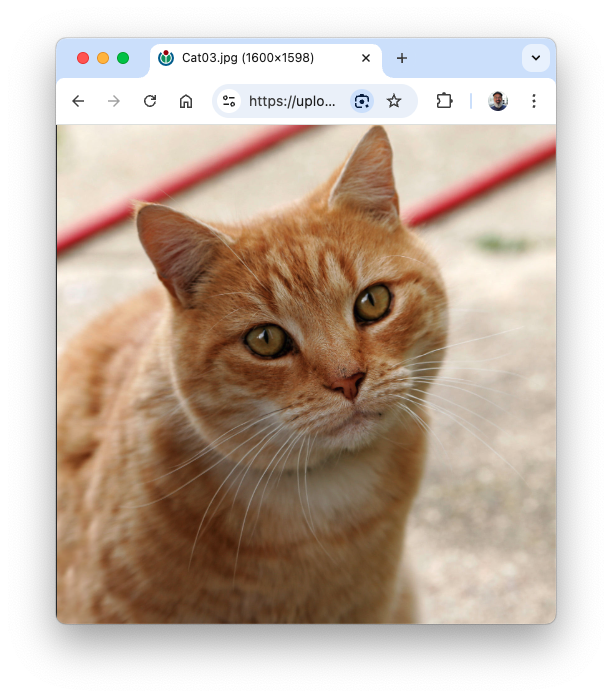{width=65% fig-align="center"}

### Understanding Input Requirements

All neural networks expect input data in a specific format, determined during training. For MobileNetV2 trained on ImageNet:

- **Input shape**: (224, 224, 3) - RGB images at 224x224 pixels
- **Batch dimension**: Models expect batch inputs, so (1, 224, 224, 3) for single images
- **Preprocessing**: MobileNetV2 uses specific normalization (scaling pixel values to [-1, 1])
- **Color channels**: RGB order (not BGR)

The preprocessing must match exactly what was used during training, or accuracy will suffer.

### Getting the Labels

For inference, we will need the ImageNet labels. The following function checks if the file exists, and if not, downloads it: 

```python
import os, json
from pathlib import Path
import requests

MODELS_DIR = Path("./models")
IMAGENET_JSON = MODELS_DIR / "imagenet_class_index.json"
IMAGENET_JSON_URL = (
    "https://storage.googleapis.com/download.tensorflow.org/data/imagenet_class_index.json"
)

# ---- one-time label download ----
def ensure_imagenet_labels():
    MODELS_DIR.mkdir(parents=True, exist_ok=True)
    if IMAGENET_JSON.exists():
        return
    print("Downloading ImageNet class index...")
    resp = requests.get(IMAGENET_JSON_URL, timeout=30)
    resp.raise_for_status()
    IMAGENET_JSON.write_bytes(resp.content)
    print("Saved:", IMAGENET_JSON)
```

The function `load_idx2label()` loads the labels into a list:

```python
def load_idx2label():
    with open(IMAGENET_JSON, "r") as f:
        class_idx = json.load(f)
    idx2label = [class_idx[str(k)][1] for k in range(len(class_idx))]
    return idx2label
```

### Image Preprocessing

The image used for inference should be preprocessed in the same way as during model training. `keras.applications.mobilenet_v2.preprocess_input()` takes an image of shape (224, 224) and converts it to `(1, 224, 224, 3)`:

```python
import numpy as np
from PIL import Image
import tensorflow as tf
from tensorflow import keras

def load_and_preprocess_image(image_path):
    img = Image.open(image_path).convert("RGB").resize((224, 224))
    arr = np.array(img).astype(np.float32)
    arr = keras.applications.mobilenet_v2.preprocess_input(arr)
    arr = np.expand_dims(arr, 0)  # Add batch dimension
    return arr
```

### Prepare Input Tensor

The processed image will serve as the model's input tensor (`x`): 

```python
ensure_imagenet_labels()
idx2label_full = load_idx2label()  # length 1000 for ImageNet

IMAGE_PATH = Path("./images/cat.jpg")
x = load_and_preprocess_image(IMAGE_PATH)
```

### Run Inference on MemryX Accelerator (MXA)

Move the models (the original and compiled) to the models folder and set up the paths:

```python
MODELS_DIR = Path("./models")
DFP_PATH = MODELS_DIR / "mobilenet_v2.dfp"
KERAS_PATH = MODELS_DIR / "mobilenet_v2.h5"
```

Run inference on the compiled model using the MemryX accelerator:

```python
from memryx import SyncAccl

accl = SyncAccl(dfp=str(DFP_PATH))
mxa_outputs = accl.run(x)
```

We get a list/array of outputs. In this case, with a shape of `(1, 1000)` and a dtype of `float32`. This output should be normalized to a NumPy array:

```python
mxa_outputs = np.array(mxa_outputs)
if mxa_outputs.ndim == 3:
    mxa_outputs = mxa_outputs[0]
```

### Decode the MXA Results

Now, using helper functions to extract top-k predictions: 

```python
def topk_from_probs(probs, k=5):
    """
    probs: (1, num_classes) or (num_classes,)
    Returns [(index, prob)] sorted by prob desc.
    """
    probs = np.array(probs)
    if probs.ndim == 2:
        probs = probs[0]
    # If outputs are logits, uncomment this:
    # probs = tf.nn.softmax(probs).numpy()
    s = probs.sum()
    if s > 0:
        probs = probs / s
    idxs = np.argsort(probs)[::-1][:k]
    return [(int(i), float(probs[i])) for i in idxs]

def label_for(idx, idx2label):
    if idx2label is not None and idx < len(idx2label):
        return idx2label[idx]
    return f"class_{idx}"
```

We can decode and print the results:

```python
mxa_top5 = topk_from_probs(mxa_outputs, k=5)
print("\nMXA top-5:")
for idx, prob in mxa_top5:
    name = label_for(idx, idx2label_full)
    print(f"  #{idx:4d}: {name:20s}  ({prob*100:.1f}%)")
```

Expected output:

```bash
MXA top-5:
  # 282: tiger_cat             (38.6%)
  # 281: tabby                 (18.3%)
  # 285: Egyptian_cat          (15.2%)
  # 287: lynx                  (3.9%)
  # 478: carton                (1.7%)
```

### Comparing CPU vs. MXA Performance

We can also run the unconverted model (`mobilenet_v2.h5`) on the CPU, applying the code to the same input tensor:

```python
cpu_model = keras.models.load_model(KERAS_PATH)
cpu_outputs = cpu_model.predict(x)

num_classes = cpu_outputs.shape[-1]
idx2label = idx2label_full if num_classes == len(idx2label_full) else None

cpu_top5 = topk_from_probs(cpu_outputs, k=5)
print("\nCPU top-5:")
for idx, prob in cpu_top5:
    name = label_for(idx, idx2label)
    print(f"  #{idx:4d}: {name:20s}  ({prob*100:.1f}%)")
```

Expected output:

```bash
CPU top-5:
  # 282: tiger_cat             (58.4%)
  # 285: Egyptian_cat          (12.9%)
  # 281: tabby                 (11.6%)
  # 287: lynx                  (3.4%)
  # 588: hamper                (1.3%)
```

Despite the probabilities not being identical, both models reach the same top prediction. The slight differences are due to numerical precision variations between CPU and accelerator implementations.

### Measuring Latency

Let's create a complete Python script (`run_inference_mobilenetv2.py`) that also measures and compares latency for both CPU and MXA. 

> **Note**: The following sections break down the complete inference script into logical components. The full working script is available separately and integrates all these pieces together.

To measure latency accurately, we'll add timing code:

```python
import time

# Warm-up run
_ = accl.run(x)

# Timed inference
start = time.time()
mxa_outputs = accl.run(x)
mxa_latency = time.time() - start

print(f"\nMXA latency: {mxa_latency*1000:.2f} ms")
```

Run the complete script [run_inference_comp_mobilenetv2.py](https://github.com/Mjrovai/EdgeML-with-Raspberry-Pi/blob/main/Hardware_Acceleration/run_inference_comp_mobilenetv2.py) in the terminal:

```bash
python run_inference_comp_mobilenetv2.py
```

Expected results:

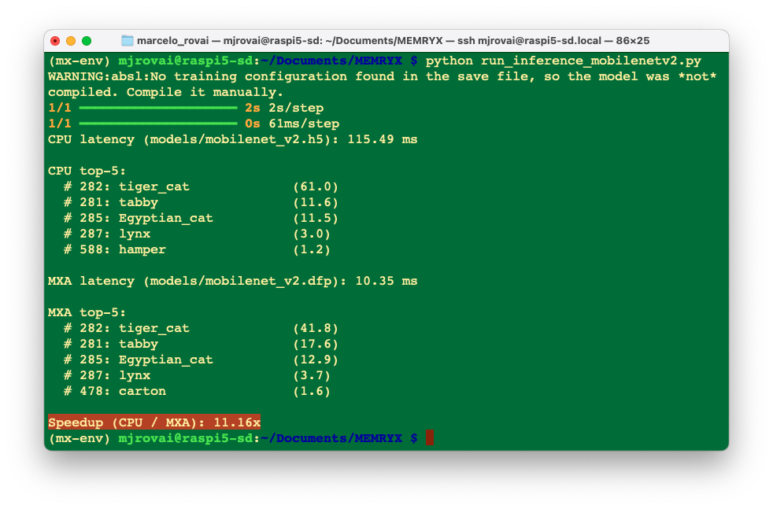

**The Accelerator runs 11 times faster than the CPU!** 

> The MobileNet V2 running with ExecuTorch/XNNPACK backend on a CPU has around 20 ms of latency. 

### Testing with Larger Models

We can also test a larger model like ResNet50:

```bash
# Download ResNet50
python3 -c "import tensorflow as tf; tf.keras.applications.ResNet50().save('resnet50.h5');"

# Compile
mx_nc -v -m resnet50.h5

# Run the script in the terminal:
python run_inference_comp_resnet50.py
```
> The  script can be found in the lab repo: [run_inference_comp_resnet50.py](https://github.com/Mjrovai/EdgeML-with-Raspberry-Pi/blob/main/Hardware_Acceleration/run_inference_comp_resnet50.py) in the terminal:

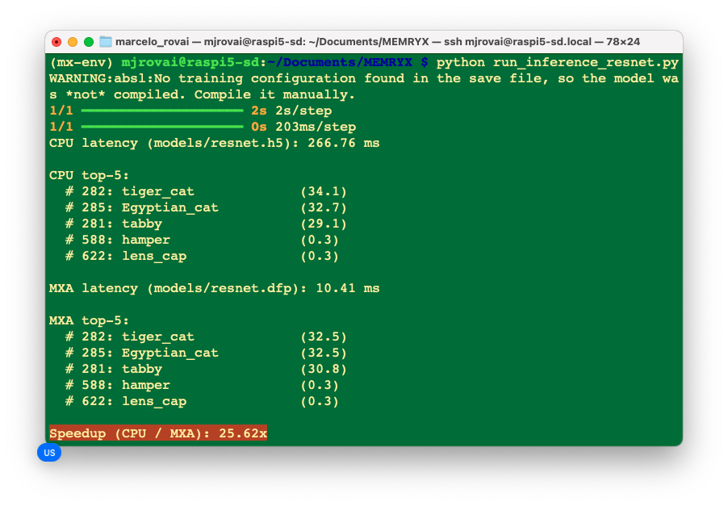

> The performance improvements are even more dramatic with larger models!
>

### Clean Shutdown

Always properly shut down the accelerator when done:

```python
accl.shutdown()
```

BTW, to shut down the Raspberry Pi via SSH, we can use

```bash
sudo shutdown -h now
```

## Folders Structure

```bash
Documents/MEMRYX/
├── run_inference_comp_mobilenetv2.py          # MobileNetV2 script
├── run_inference_comp_resnet50.py             # ResNet50 script
├── images/
│   ├── cat.jpg                           # Test image
├── models/
│   ├── mobilenet_v2.h5                   # Original model
│   ├── mobilenet_v2.dfp                  # Compiled model
│   ├── resnet50.h5                       # Original model
│   ├── resnet50.dfp                      # Compiled model
│   └── imagenet_class_index.json         # Labels (auto-downloaded)
└── mx-env/   
```

## Performance Comparison Summary

Here's how the MX3 compares across different deployment approaches we've covered in this course:

| Approach | Hardware | MobileNetV2 Latency | ResNet50 Latency | Power (Active) |
|----------|----------|---------------------|------------------|----------------|
| TFLite (CPU) | Raspberry Pi 5 | ~110 ms | ~266 ms | ~ |
| ExecuTorch/XNNPACK | Raspberry Pi 5 | ~20 ms | NA | ~ |
| **MemryX MX3** | **Dedicated accelerator** | **~10 ms** | **~10 ms** | **~** |

### Key Observations

- **25x faster** than unoptimized TFLite on CPU (Resnet50)
- **2x faster** than highly optimized ExecuTorch with XNNPACK (MobileNetV2)
- **Minimal CPU load**: The host CPU is free for preprocessing, postprocessing, and application logic
- **Consistent latency**: Hardware acceleration provides deterministic performance
- **Power efficiency**: Not measured

### When to Use the MX3?

The MemryX MX3 is ideal for:

- ✅ **Real-time applications** requiring <20ms latency
- ✅ **Multi-stream processing** (multiple cameras, sensors)
- ✅ **Power-constrained environments** where CPU load matters
- ✅ **Production deployments** requiring consistent, predictable performance
- ✅ **Complex models** where CPU inference is too slow

The MX3 may be overkill for:

- ❌ Simple models that run fast enough on CPU
- ❌ Non-latency-critical batch processing
- ❌ Prototyping where development speed matters more than performance
- ❌ Very cost-sensitive applications

## YOLOv8 Object Detection with MX3 Hardware Acceleration

In this part of the lab, we'll deploy YOLOv8n (nano) for real-time object detection using the MemryX MX3 AI accelerator on Raspberry Pi 5. We'll cover the complete workflow from model export to inference optimization.


But first, we should install ULTRALYTICS

The MemoryX team suggested:

```bash
pip install ultralytics==8.3.161
```

If you face issues, try it with:

```bash
pip install ultralytics[export]
```

If you still have issues, reinstall memryx

```bash
pip3 install --extra-index-url https://developer.memryx.com/pip memryx
```

Now,  download the YOLOv8.pt model and test it:

```bash
yolo predict model='yolov8n' source='https://ultralytics.com/images/bus.jpg'
```

The model and the image `bus.jpg` will be downloaded and tested with the YOLOV8n:

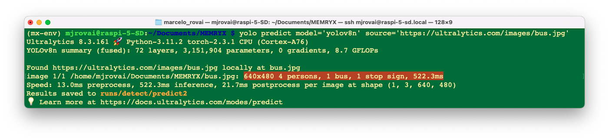

> 4 persons, 1 bus, and one stop signal were detected in 522 ms. 

Under `./runs/detect`, the output processed image can be analysed: 

{width=65% fig-align="center"}

### Model Export and Compilation

#### Step 1: Export YOLOv8 to ONNX

YOLOv8 must be converted to ONNX format before compilation for the MX3:

```python
from ultralytics import YOLO

#### Load pretrained YOLOv8n model
model = YOLO('yolov8n.pt')

#### Export to ONNX format
model.export(format='onnx', simplify=True)
```

This creates `yolov8n.onnx` with the complete model graph.

We can also use CLI for the conversion:

```bash
yolo export model=yolov8n.pt format=onnx
```

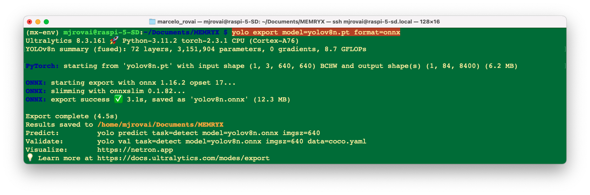

#### Step 2: Compile for MX3

We can use the MemryX Neural Compiler to generate the DFP file:

```bash
mx_nc -v --autocrop -m yolov8n.onnx
```

**Key flags:**

- `-v`: Verbose output for debugging
- `-m`: Input model path
- `--autocrop`: Automatically split model for optimal MX3 execution

**Output files:**

- `yolov8n.dfp` - Accelerator executable (runs on MX3 chips)
- `yolov8n_post.onnx` - Post-processing model (runs on CPU)

**Why Two Files?**

The MX3 compiler splits the model:

1. **Feature extraction** (yolov8n.dfp): Neural network backbone on MX3 hardware
2. **Detection head** (yolov8n_post.onnx): Bounding box decoding on CPU

This hybrid approach optimizes performance by running computationally intensive operations on the accelerator while keeping final post-processing flexible.

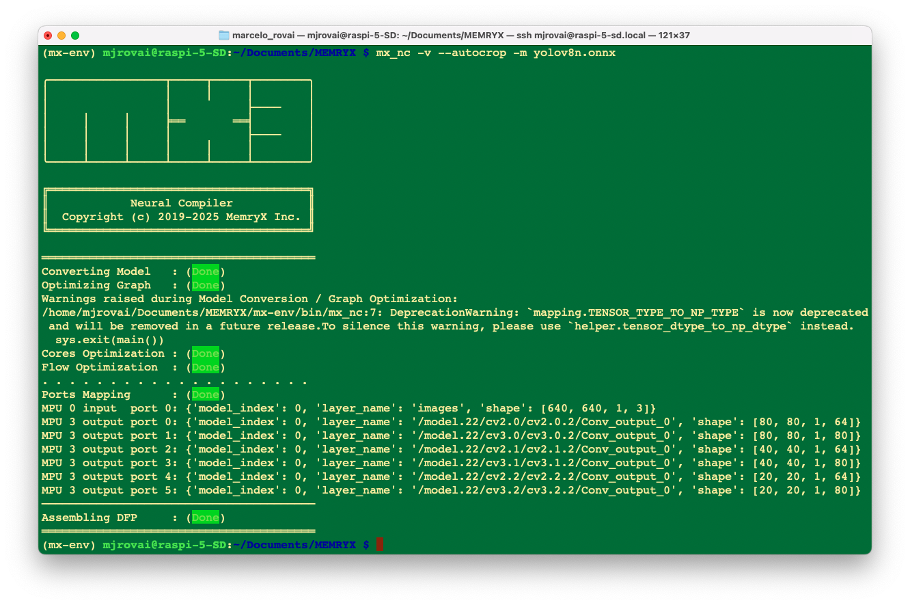

Now, let's check the model with a benchmark

```bash
mx_bench -d yolov8n.dfp -f 1000
```

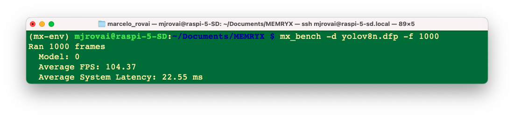

### Understanding YOLOv8 Output Format

#### YOLOv8 Output Structure

The post-processing model outputs predictions in shape `(1, 84, 8400)`:

- **Dimension 0 (1)**: Batch size
- **Dimension 1 (84)**: 
  - First 4 values: Bounding box `[x_center, y_center, width, height]`
  - Next 80 values: Class probabilities (COCO dataset)
- **Dimension 2 (8400)**: Anchor points across three detection scales:
  - 80×80 = 6400 points (small objects)
  - 40×40 = 1600 points (medium objects)
  - 20×20 = 400 points (large objects)

#### Decoding Process

1. **Transpose**: Convert from `(1, 84, 8400)` → `(8400, 84)`
2. **Extract**: Separate boxes and class scores
3. **Filter**: Keep predictions above confidence threshold
4. **Convert coordinates**: Transform from `xywh` to `xyxy`
5. **NMS**: Remove overlapping detections
6. **Scale**: Map to original image coordinates

### Complete Inference Pipeline

We should now create a script to run an object detector (YOLOv8 with a pre/post-processing pipeline), print each detection (label, confidence, bounding box), and save a copy of the image with the boxes drawn.

#### Configuration section

At the top of `__main__` we define the configuration values:

```python
DFP_PATH = "./models/yolov8n.dfp"
POST_MODEL_PATH = "./models/yolov8n_post.onnx"
IMAGE_PATH = "./images/bus.jpg"
CONF_THRESHOLD = 0.25
```

- `DFP_PATH`: path to the compiled model used for inference.  
- `POST_MODEL_PATH`: path to a post-processing model or graph, usually converting raw outputs into boxes, scores, and class IDs.  
- `IMAGE_PATH`: image file we want to run detection on.  
- `CONF_THRESHOLD`: minimum confidence score; detections below this are filtered out.

#### Running detection

```python
detections, annotated_image, inference_time = detect_objects(
    DFP_PATH,
    POST_MODEL_PATH,
    IMAGE_PATH,
    CONF_THRESHOLD
)
```

Here we call a helper function `detect_objects` that encapsulates the heavy lifting:

- Loads the model(s).  
- Loads and preprocesses the image.  
- Runs inference.  
- Applies post-processing (NMS, thresholding, etc.).  
- Returns:
  - `detections`: list/array where each element is `[x1, y1, x2, y2, conf, class_id]`.  
  - `annotated_image`: a PIL image with bounding boxes and labels drawn.  
  - `inference_time`: time spent doing the detection (in milliseconds).

#### Printing results

```python
print(f"\n{'='*60}")
print("Detection Results:")
print(f"{'='*60}")
for i, det in enumerate(detections):
    x1, y1, x2, y2, conf, class_id = det
    print(f"  {i+1}. {COCO_CLASSES[int(class_id)]}: {conf:.3f}")
    print(f"      Box: [{int(x1)}, {int(y1)}, {int(x2)}, {int(y2)}]")
```

- The loop goes over each detection, unpacks the bounding box coordinates, confidence, and class ID.  
- `COCO_CLASSES[int(class_id)]` converts the numeric class index into a human-readable label (e.g., “person”, “bus”).  
- Coordinates are cast to `int` for cleaner printing.

#### Saving the annotated image

```python
if len(detections) > 0:
    output_path = IMAGE_PATH.rsplit('.', 1)[0] + '_detected.jpg'
    annotated_image.save(output_path)
    print(f"\nSaved: {output_path}")
```

- Only saves an output file if at least one object was detected.  
- The output filename is built by taking the original name and appending `_detected` before the extension (e.g., `bus_detected.jpg`).  
- `annotated_image.save(...)` writes the image with drawn boxes and labels to disk.

#### Final summary output

```python
print(f"\n{'='*60}")
print(f"Total: {len(detections)} objects")
print(f"Time: {inference_time:.2f} ms")
print(f"{'='*60}")
```

- Prints how many objects were found in total.  
- Prints the inference time, which is useful to talk about performance (e.g., model size vs. speed, hardware differences).  

Run the script [yolov8_m3_detect.py](https://github.com/Mjrovai/EdgeML-with-Raspberry-Pi/blob/main/Hardware_Acceleration/yolov8_mx3_detect.py)

```bash
python yolov8_m3_detect.py
```

As a result, we can see that the models found 4 persons and 1 bus, missing only the stop signal. Regarding latency, the **MX3 runs inference about 11 times faster than a CPU-only** system. 

> Basically, the same accuracy result that we got on the YOLO chapter running yolov11

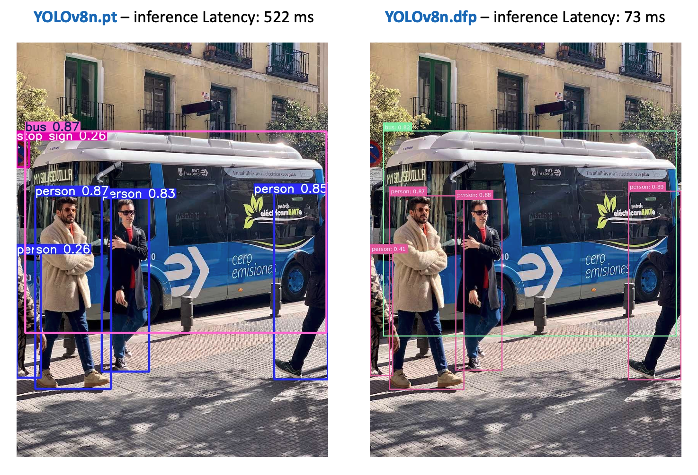{width=95% fig-align="center"}

### Going deeper into the functions

#### 1. Image preprocessing (`preprocess_image`)

`original image → resized → padded → tensor`

- Load and normalize:
  - Open the image with PIL, convert to RGB, and get its original size.
  - Compute a scale `ratio` so the image fits into 640×640 without distortion (preserving aspect ratio).
- Letterboxing:
  - Resize the image to `(new_w, new_h) = (int(w * ratio), int(h * ratio))`.
  - Paste it onto a 640×640 canvas filled with color `(114, 114, 114)` (same as Ultralytics).  
  - Compute the padding offsets `(pad_w, pad_h)` so we can undo this later.
- Tensor conversion:
  - Convert to `numpy`, normalize to `[0,1]`, permute from HWC to CHW, and add a batch dimension to get shape `[1, 3, 640, 640]`, which matches YOLOv8’s expected input.[1][2]

#### 2. Decoding YOLOv8 output (`decode_predictions`)

*How to turn raw model numbers into human-readable detections.*

**The raw output format:**

- For COCO YOLOv8n ONNX, the detection head outputs a tensor of shape `(1, 84, 8400)`.
- `84 = 4 (bbox) + 80 (class scores)`. Each of the 8400 positions corresponds to one candidate box.

**Function Walkthrough:**

- Transpose:
  - From `(1, 84, 8400)` to `(8400, 84)` so each row is: `[x_center, y_center, width, height, class_0_score, ..., class_79_score]`.
- Best class per box:
  - Take `max_scores = np.max(class_scores, axis=1)` and `class_ids = np.argmax(class_scores, axis=1)` to select the most likely class and its score for each of the 8400 candidates.
- Confidence filtering:
  - Drop boxes whose max class score is below `conf_threshold`.
- Coordinate conversion:
  - Convert from YOLO’s center-format `(x, y, w, h)` to corner-format `(x1, y1, x2, y2)` to make drawing and IoU calculation simpler.
- NMS:
  - Call `apply_nms` to remove overlapping boxes and keep only the best ones.

#### 3. IoU and NMS (`compute_iou_batch` and `apply_nms`)

**IoU:**

- IoU (Intersection over Union) measures overlap between two boxes:  
  $$\text{IoU} = \frac{\text{area of intersection}}{\text{area of union}}$$
- `compute_iou_batch` does this between one box and many boxes at once using vectorized Numpy operations.

**NMS:**

- `apply_nms`:
  - Sort boxes by score descending.
  - Repeatedly pick the highest-score box, compute its IoU with the remaining boxes, and discard those whose IoU is above `iou_threshold`.
- The result is a list of indices for boxes that don’t overlap too much and represent unique objects.

#### 4. Mapping back to the original image (`scale_boxes_to_original`)

*Everything after the model must undo what preprocessing did.*

- During preprocessing, we:
  - Rescaled the image by `ratio`.
  - Padded by `(pad_w, pad_h)`.
- The model’s boxes live in that padded, resized 640×640 space.
- `scale_boxes_to_original`:
  - Subtracts the padding.
  - Divides by `ratio` to go back to the original resolution.
  - Clips coordinates so they stay inside the original image bounds.

#### 5. Drawing results (`draw_detections`)

`model output → decoded boxes → drawn on the original image`

- Make a copy of the original image and get an `ImageDraw` context.
- For each detection:
  - Choose a color deterministically using `np.random.seed(class_id)` so the same class always has the same color.
  - Draw the rectangle `[x1, y1, x2, y2]`.
  - Build a label string `"class_name: confidence"`, measure text size using `textbbox`, draw a filled rectangle for the label background, and render the text.

#### 6. The Memryx pipeline (`detect_objects` and `AsyncAccl` usage)

*How to integrate Memryx’s async accelerator into a typical vision pipeline*

- Preprocess once: call `preprocess_image` to get the model-ready tensor and the info needed for rescaling.
- Create the accelerator:
  - `accl = AsyncAccl(dfp_path)` loads the compiled Memryx DFP model.
  - `accl.set_postprocessing_model(post_model_path, model_idx=0)` attaches the ONNX post-processing graph.
- Streaming-style design:
  - `frame_queue` is a queue of inputs; you put your tensor in it.
  - `generate_frame` is a generator feeding frames into the accelerator.
  - `process_output` is a callback that collects outputs into `results`.
  - The code wires them with `connect_input` and `connect_output`, then waits for completion with `accl.wait()`.
- Post-processing:
  - Grab the first output, call `decode_predictions`, rescale boxes, and draw.

### Making Inferences

Let's change the script to easily handle different images and confidence threshold ([yolov8_m3_detect_v2.py](https://github.com/Mjrovai/EdgeML-with-Raspberry-Pi/blob/main/Hardware_Acceleration/yolov8_mx3_detect_v2.py)). We should replace the hardcoded `IMAGE_PATH` with a command-line argument:

```python
import argparse

if __name__ == "__main__":
    parser = argparse.ArgumentParser()
    parser.add_argument(
        "-i", "--image",
        type=str,
        required=True,
        help="Path to input image"
    )
    parser.add_argument(
        "-c", "--conf",
        type=float,
        default=0.25,
        help="Confidence threshold"
    )
    args = parser.parse_args()

    # Configuration
    DFP_PATH = "./models/yolov8n.dfp"
    POST_MODEL_PATH = "./models/yolov8n_post.onnx"
    IMAGE_PATH = args.image
    CONF_THRESHOLD = args.conf

    # Run detection
    detections, annotated_image, inference_time = detect_objects(
        DFP_PATH,
        POST_MODEL_PATH,
        IMAGE_PATH,
        CONF_THRESHOLD
    )

    # Print results
    print(f"\n{'='*60}")
    print("Detection Results:")
    print(f"{'='*60}")
    for i, det in enumerate(detections):
        x1, y1, x2, y2, conf, class_id = det
        print(f"  {i+1}. {COCO_CLASSES[int(class_id)]}: {conf:.3f}")
        print(f"      Box: [{int(x1)}, {int(y1)}, {int(x2)}, {int(y2)}]")

    # Save annotated image
    if len(detections) > 0:
        output_path = IMAGE_PATH.rsplit('.', 1)[0] + '_detected.jpg'
        annotated_image.save(output_path)
        print(f"\nSaved: {output_path}")

    print(f"\n{'='*60}")
    print(f"Total: {len(detections)} objects")
    print(f"Time: {inference_time:.2f} ms")
    print(f"{'='*60}")

```

We can run it as: 

```bash
python yolov8_mx3_detect_v2.py --image ./images/home-office.jpg -c 0.2
```

Here are some results with other images:


## Inference with a custom model

As we saw in the YOLO chapter, we are assuming we are in an industrial facility that must sort and count **wheels** and special **boxes**. 

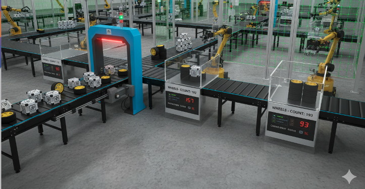{width=85% fig-align="center"}

Each image can have three classes:

- Background (no objects)
- Box
- Wheel

We have captured a raw dataset using the Raspberry Pi Camera and labeled it with the ROBOFLOW. The Yolo model was trained on a Google Colab using Ultralytics. 


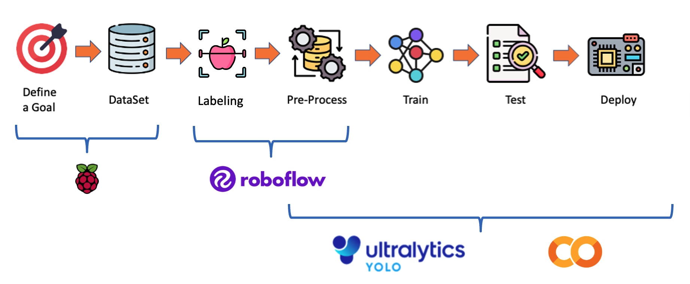

After training, we download the trained model from `/runs/detect/train/weights/best.pt` to our computer, renaming it to `box_wheel_320_yolo.pt`. 

> Using the FileZilla FTP, transfer a few images from the test dataset to `.\images`:
>

Let's return to the `./MEMRYX/YOLO` folder and using the Python Interpreter, to quickly do some inferences:

```bash
python
```

We will import the YOLO library and define the model to use:

```python
>>> from ultralytics import YOLO
>>> model = YOLO('./models/box_wheel_320_yolo.pt')
```

Now, let's define an image and call the inference (we will save the image result this time to external verification):

```python
>>> img = './images/box_3_wheel_4.jpg'
>>> result = model.predict(img, save=True, imgsz=320, conf=0.5, iou=0.3)
```

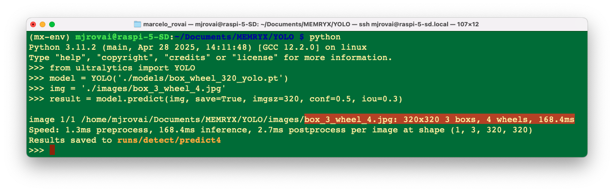

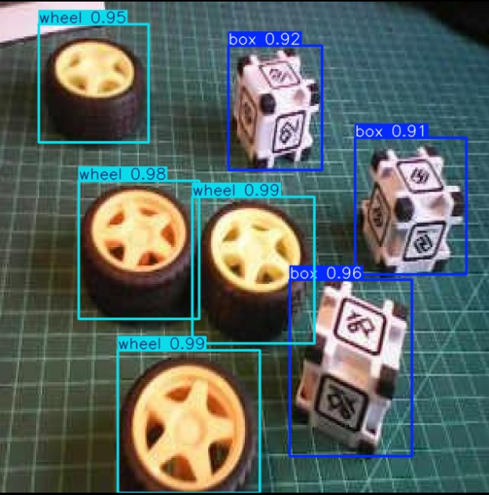{width=65% fig-align="center"}

We can see that the model is working and that the latency was 168 ms. 

Let's now export the model first to ONNX and after to FFPls

, to run it in the MX3 device:

```bash
cd ./models
yolo export model=box_wheel_320_yolo.pt format=onnx
mx_nc -v --autocrop -m box_wheel_320_yolo.onnx
cd ..
```

In the models folder, we will have `box_wheel_320_yolo.dfp` and `box_wheel_320_yolo_post.onnx`

Let's adapt the previous script to be more generic in terms of models ([box_wheel_mx3_detect_v2.py](https://github.com/Mjrovai/EdgeML-with-Raspberry-Pi/blob/main/Hardware_Acceleration/box_wheel_mx3_detect_v2.py)):

> Naturally we should enter with the new models 'names and instead of COCO_LABELS, the script was changed to:
>
> ```python
> # dataset class names 
> CLASSES = [
>     'Box', 'Wheel'
> ]
> ```
>
> Thant's all!

Run it with:

```bash
python box_wheel_mx3_detect_v2.py --image ./images/box_3_wheel_4.jpg
```

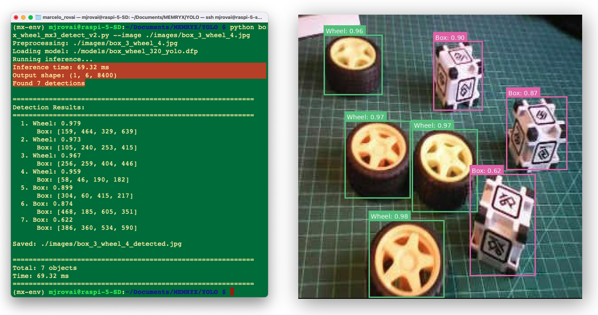{width=85% fig-align="center"}

The Result was great! **And the latency (~38 ms) was 4 times lower than with the CPU-only** approach (even smaller than the model exported to NCNN, runing 100% at CPU - 80 ms).

### Adjusting Confidence Threshold

Lower confidence for more detections (may include false positives):

```bash
python box_wheel_mx3_detect_v2.py --image ./images/box_3_wheel_4.jpg -c 0.15
```

We should experiment with the right confidence threshold. 

## **Advanced Topics**

### Batch Processing (Optimization)

For multiple images, reuse the accelerator instance:
```python
accl = AsyncAccl(dfp_path)
accl.set_postprocessing_model(post_model_path)

for image_path in image_list:
    detections = detect_single_image(accl, image_path)
```

### Thermal Management

Always monitor temperature during operation:

```bash
watch -n 1 cat /sys/memx0/temperature
```

### Confidence Threshold Tuning

- **0.15-0.20**: Maximum recall (catch everything)
- **0.25-0.40**: Balanced (default)
- **0.45-0.50**: High precision (only confident detections)

### Model Selection

- **yolov8n**: Fastest, 3.2M parameters
- **yolov8s**: Balanced, 11.2M parameters
- **yolov8m**: Accurate, 25.9M parameters

## Exploring MemryX eXamples

**[MemryX eXamples](https://github.com/memryx/MemryX_eXamples/tree/release)** is a collection of end-to-end AI applications and tasks powered by MemryX hardware and software solutions. These examples provide practical, hands-on use cases to help leverage MemryX technology. 

### Clone the MemryX eXamples Repository

Clone this repository plus any linked submodules:

```bash
git clone --recursive https://github.com/memryx/memryx_examples.git
cd memryx_examples
```

After cloning the repository, you'll find several subdirectories with different categories of applications:

- **image_inference** - Single image classification and detection
- **video_inference** - Real-time video processing
- **multistream_video_inference** - Multi-camera scenarios
- **audio_inference** - Audio processing and speech recognition
- **open_vocabulary** - Open-set classification tasks
- **accuracy_calculation** - Model accuracy verification
- **multi_dfp_application** - Running multiple models
- **optimized_multistream_apps** - Production-ready multi-stream examples
- **fun_projects** - Creative applications and demos

These examples demonstrate best practices for:

- Preprocessing pipelines
- Multi-threaded inference
- Output visualization
- Performance optimization
- Multi-model orchestration

Exploring these examples is an excellent way to learn production-ready patterns for deploying MemryX applications.

## Troubleshooting Common Issues

### Device Not Detected

**Symptom**: `ls /dev/memx*` returns "No such file or directory"

**Solutions**:
1. **Verify physical connection**: Reseat the M.2 module in its slot
2. **Check PCIe settings**: 
   ```bash
   sudo raspi-config
   # Navigate to: Advanced Options → PCIe Speed → Enable PCIe Gen 3
   sudo reboot
   ```
3. **Verify in kernel logs**:
   ```bash
   dmesg | grep -i memryx
   lspci | grep -i memryx
   ```

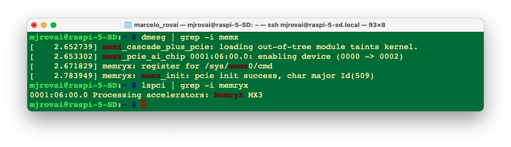

4. **Ensure sufficient power**: Use the official Raspberry Pi 27W power supply

5. **Check HAT installation**: Ensure the M.2 HAT is properly seated.

6.  **Lower Frequency**: Try running `sudo mx_set_powermode` with a lower frequency, such as 200 or 300 MHz. Then restart mxa-manager for good measure with `sudo service mxa-manager restart`
    
    
```bash
sudo mx_set_powermode
```
    
    

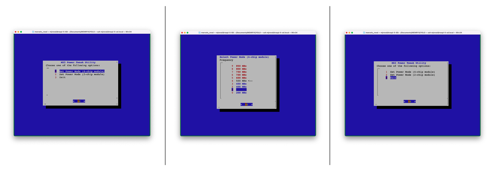

```bash
sudo service mxa-manager restart
```

Check the frequency with the following command:

```bash
cat /etc/memryx/power.conf
```

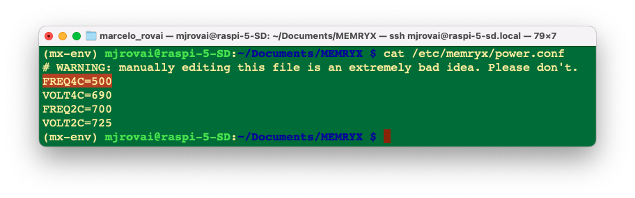

We can check it by the first field of the file, `FREQ4`. If the Raspberry Pi is set to the module's default operating frequency (500 MHz), we should see `FREQ4C=500`, indicating that the module is set to a 500 MHz clock speed for 4-chip DFPs. 

> If decreasing the frequency solves the issue, then you can either keep the default frequency for all DFPs at 300 MHz (or 400, 450, etc.), or you can raise it back to 500 MHz and use the [C++ API's set_operating_frequency function](https://developer.memryx.com/api/accelerator/cpp.html#_CPPv4N2MX7Runtime10MxAcclBase23set_operating_frequencyEiN2MX5Types17MxFrequencyOptionE) to change the clock speed on a per-DFP basis.

### Compilation Errors

**Symptom**: `mx_nc` fails with "Unsupported operator" error

**Solutions**:
1. Check the [supported operators](https://developer.memryx.com/specs/supported_ops.html)
2. Some custom layers may need reformulation
3. Try exporting to ONNX first for better compatibility:
   ```python
   import tensorflow as tf
   import tf2onnx
   
   
   model = tf.keras.models.load_model('model.h5')
   onnx_model, _ = tf2onnx.convert.from_keras(model)
   with open("model.onnx", "wb") as f:
       f.write(onnx_model.SerializeToString())
   ```
4. Check the compilation log (`-v` flag) to identify which specific layer is causing issues

### Thermal Throttling

**Symptom**: Performance degrades over time, temperature > 90°C

**Solutions**:
1. **Verify heatsink installation**: Ensure thermal paste is properly applied and heatsink is firmly attached
2. **Improve airflow**: Position the Raspberry Pi for better air circulation
3. **Check ambient temperature**: Ensure the room temperature is reasonable (<30°C)
4. **Monitor continuously**:
   
   ```bash
   watch -n 1 cat /sys/memx0/temperature
   ```
5. **Consider additional cooling**: Add a small fan directed at the heatsink

### Python Version Conflicts

**Symptom**: `pip install memryx` fails with compatibility errors

**Solutions**:

1. Verify Python version:
   ```bash
   python --version  # Must show 3.11.x or 3.12.x
   pip --version     # Should match the Python version
   ```
2. Ensure you're in the virtual environment:
   ```bash
   which python  # Should point to mx-env/bin/python
   ```
3. Try reinstalling in a fresh virtual environment:
   ```bash
   deactivate
   rm -rf mx-env
   python -m venv mx-env
   source mx-env/bin/activate
   pip install --upgrade pip wheel
   pip install --extra-index-url https://developer.memryx.com/pip memryx
   ```

### Low FPS / Poor Performance

**Symptom**: Benchmark shows much lower FPS than expected

**Solutions**:
1. **Check for thermal throttling**: 
   ```bash
   cat /sys/memx0/temperature  # Should be <80°C
   ```
2. **Verify PCIe Gen 3 is enabled** (not Gen 2):
   ```bash
   sudo raspi-config
   # Advanced Options → PCIe Speed
   ```
3. **Close other PCIe-intensive applications**: Ensure no other devices are saturating the PCIe bus

4. **Check for background CPU load**:
   ```bash
   htop
   ```
   
5. **Verify driver version**: Ensure you have the latest drivers

   ```bash
   apt policy memx-drivers
   ```
6. **Verify Frequency**

​        By default, the frequency should be at 500 MHz. Smaller frequencies will reduce the FPS (increase the latency)

```bash
   cat /etc/memryx/power.conf
```

### Import Errors

**Symptom**: `ImportError: cannot import name 'SyncAccl' from 'memryx'`

**Solutions**:
1. Ensure memryx is installed in the current environment:
   ```bash
   pip list | grep memryx
   ```
2. Reinstall if necessary:
   ```bash
   pip install --force-reinstall --extra-index-url https://developer.memryx.com/pip memryx
   ```
3. Check Python path conflicts:
   ```python
   import sys
   print(sys.path)
   ```

### Model Accuracy Issues

**Symptom**: Inference results are incorrect or significantly different from CPU

**Solutions**:
1. **Verify preprocessing**: Ensure the same preprocessing is applied as during training
2. **Check input normalization**: Confirm the value range matches training (e.g., [0, 1] vs [-1, 1])
3. **Test with known inputs**: Use the validation dataset to verify accuracy
4. **Compare outputs numerically**: Print raw logits/probabilities to identify differences
5. **Check for quantization effects**: If using `-q` flag, try without quantization first

## Next Steps and Extensions

### Project Ideas

1. **Real-time Object Detection with Camera**
   - Integrate picamera2 with YOLO
   - Display bounding boxes in real-time
   - Measure end-to-end latency (capture → inference → display)

2. **Multi-Model Pipeline**
   - Use detection + classification cascade
   - Leverage multiple MX3 chips for parallel inference
   - Build a smart surveillance system

3. **Custom Model Deployment**
   - Train your own model for a specific task
   - Optimize and compile for MX3
   - Compare against the models from previous labs

4. **Power Efficiency Study**
   - Measure power consumption with a USB meter
   - Compare CPU vs. MX3 energy per inference
   - Calculate battery life for mobile applications

5. **Multi-Stream Processing**
   - Process multiple camera streams simultaneously
   - Demonstrate chip utilization across streams
   - Build a multi-camera monitoring system

### Advanced Topics to Explore

- **Quantization**: Experiment with 8-bit and 4-bit quantization for even better performance
- **Model Zoo**: Explore pre-optimized models in the MemryX Model Explorer
- **Async API**: Use AsyncAccl for non-blocking, concurrent processing
- **Custom Operators**: Learn to handle models with custom layers
- **Multi-chip Scaling**: Understand how workload distributes across the four accelerators

## Conclusion

In this lab, we've explored hardware acceleration for edge AI using the MemryX MX3 accelerator. We've learned:

1. ✅ How to install and configure the MX3 hardware
2. ✅ The MX3 compilation and deployment workflow
3. ✅ How to benchmark and measure performance
4. ✅ Building complete inference applications
5. ✅ Comparing CPU vs. dedicated accelerator performance

The MX3 demonstrates that dedicated AI accelerators can deliver significant performance improvements for edge applications, achieving FPS several times higher (up to 25x for ResNet-50) than CPU inference while maintaining accuracy and providing deterministic latency.

As edge AI continues to evolve, hardware acceleration will become increasingly important for real-time, power-efficient deployments. The skills we've developed in this lab—understanding the compilation workflow, benchmarking methodologies, and performance optimization—will transfer to other accelerator platforms as well.

## References and Further Reading

### Official Documentation

1. [MemryX Developer Hub](https://developer.memryx.com/)
2. [MX3 Product Brief](https://memryx.com/wp-content/uploads/2025/04/MX3-M.2-AI-Accelerator-Module-Product-brief-DEC25-Gold.pdf)
3. [Architecture Overview](https://developer.memryx.com/architecture/architecture.html)
4. [Supported Operators](https://developer.memryx.com/specs/supported_ops.html)

### Code and Examples

5. [MemryX eXamples Repository](https://github.com/memryx/MemryX_eXamples)
6. [MemryX GitHub Organization](https://github.com/MemryX)
7. [Model eXplorer](https://developer.memryx.com/model_explorer/models.html)
8. [Lab Code Repo](https://github.com/Mjrovai/EdgeML-with-Raspberry-Pi/tree/main/Hardware_Acceleration) 

### Background Reading
9. [MLSys Book - Hardware Acceleration](https://mlsysbook.ai/book/contents/core/hw_acceleration/hw_acceleration.html)
10. [Raspberry Pi PCIe Documentation](https://www.raspberrypi.com/documentation/computers/raspberry-pi-5.html#pcie-gen-3-mode)

### Community and Support

11. [MemryX YouTube Channel](https://www.youtube.com/@MemryxInc)
12. [MemryX Support Portal](https://developer.memryx.com/support/index.html)

